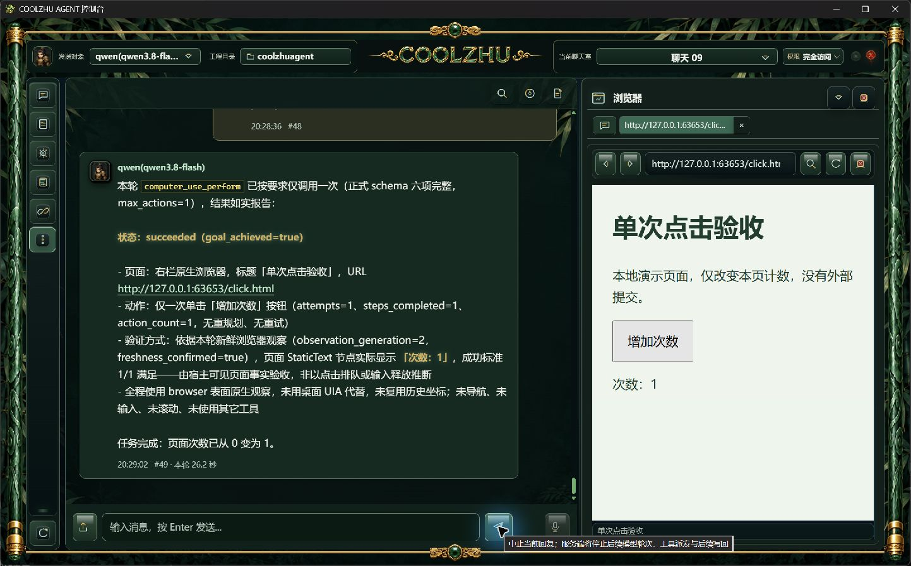
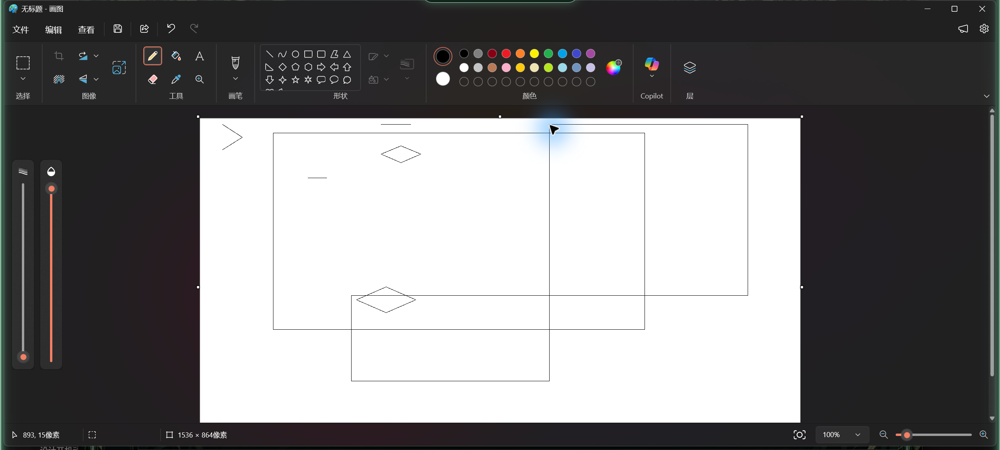
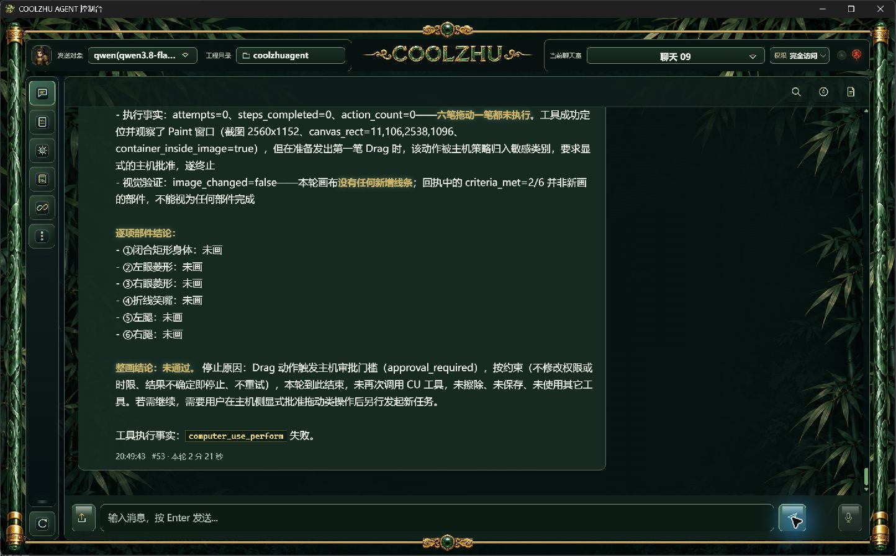

# 0.2.62 改动、真实验收与针对性测试设计依据

2026-10-01。主会话独立执行，真实 qwen3.8-flash/medium、原百炼 Base URL 及保存密钥不变；不使用模型夹具、人工代点或代画认领成功。微信不改不测，Devin 搁置，GPT-6 Pro 补审按用户决定暂停。062 失败保留，不用后续修复回填通过。

## 改动与职责

061 的原生网页和模型点击已工作，但右栏仍显示“正在载入”。062 将独立前端模块的全局 Any 监听改为当前 WebView 的定向监听，匹配后端 EventTarget::Webview。继续定向发送，不向外部网页广播地址或房间信息；不新增轮询或 Agent 主循环，不改输入权限、世代、取消和释放守卫。[窄修审查](../../analysis/2026-10-01-native-browser-state-listener-review.md)记录本机固定 Tauri 2.10.3 官方源码依据。

源码 e4806bd20da41bf321bb024597a04dd8b547b830；离线 Web build 通过。对应远端运行 36860575029、36860570243 均 completed/success，原始 jobs 回执在 evidence/ci。这些检查不代表后来提交的结果。

## 安装包与正式身份

MSI 247016829 字节，SHA256 为 ca1d0416a823a5b33ea59ac33ee6ac63a06843062dabe48121c3a4b8f5079804，报告 pkg-report-release-20261001-201832904-3ccddf05。六项发布门通过、安全扫描 0 发现、859 载荷文件/324548070 字节及 10 关键产物摘要匹配。源码快照 061afd2a6af73560687d0b48a654d5077fc85b044ea7abb5f5dd0709966a6eee；载荷快照 58d0e6bb3e24f3698247c5f521c94efa60ce51b290a7ead45f2322c12169556b。构建工作树有既有修改，以源码快照为权威，不能声称包等同干净提交。

正常关闭旧版后 MSI 交互安装退出 0，唯一注册版本 0.2.62；10 个安装文件摘要匹配。首轮正式 Web PID28908、Shell PID27092；临时时限对照重启后 Web PID20128、Shell PID12592，8765 唯一监听者为该正式 Web，见两份 installed-artifacts 身份。启动入口约 13 秒后报告自身无可定位窗口，子控制台实际启动并核验，未重复启动。此轮未捕获舞剑动画，不能由启动成功追加动画验收。

## 软件实操结果

| 测项 | 本轮事实 | 判定 |
|---|---|---|
| 聊天链接打开浏览器 | 真实历史消息 #47 的 click.html 链接打开右栏，页面标题“单次点击验收”、次数 0，底部显示真实标题 | 通过，载入状态收尾已修 |
| 窗口最大化、还原 | 原生页面区域与右栏正确调整，标题同步 | 通过 |
| 关闭、再由原链接重开 | fresh 图确认关闭，再打开显示原网页/次数 0，标题正确；即时第一拍旧状态不代替 fresh 结果 | 通过 |
| 地址栏异址、后退、前进、刷新 | click.html 与另一端口 slow.html 正确切换；各次页面和底部真实标题一致 | 通过正常导航；slow.html 仅按键处理慢，不是慢 HTTP 载入测试 |
| BU062-SINGLE-DA | 父 run-chat-3f681fcb453dcc78d0c7741a46e235756bf3cb7dbcc8248c，26.145 秒；真实 Qwen 一次 click，页面 0→1，1 动作/1 步、sent/released/verified、fresh generation2，0 重规划 | 通过 |
| CU062-SPONGE-DB，120 秒 | 父 run-chat-3fe3a913eb9df4356d3a44708a50f653463a25952ec86622，138.499 秒；首验 65.520 秒、规划 23.288 秒；一笔五点身体轨迹完整投递/释放，后验只剩 18389ms 并 stage_timeout | 失败；后五部件未执行，完整海绵宝宝未过 |
| DB 原图独立复核 | 2560×1152 原图可见新增矩形；但与旧线相交，未满足新独立身体要求。缩小窗口预览会丢失一像素细线，不能由缩图认定接口漏画 | 原始输入接口有实际效果；选点问题仍保留 |
| CU062-SPONGE-DC，300 秒独立对照 | 父 run-chat-6c7ebdb989b01d3ea247c97265e5474bfb2aca061bccd121，141.575 秒；实际 CU 预算 300000ms；首验 17.287 秒、规划 92.516 秒，首次拖动审批阶段 approval_required，0 步/0 输入 | 失败；Agent 将既有许可声明误判为授权操作，063 窄修后须实操 |

DC 不是模型漏参、时限耗尽或真正安装弹窗。模型将“用户已明确授权本次 Paint 手绘测试”写在 objective 开头，宿主合并语义分类把该“授权”当作授权动作。不得通过点击安全审批掩盖；[独立窄修审查](../../analysis/2026-10-01-paint-authorization-claim-review.md)和后续版本结果分别保留。

临时对照仅改既有 computer_use.controller.timeout_seconds 120→300；其它配置逐值相同，权限、模型、重试和动作硬上限未变。结束后正常关闭正式进程，逐值确认无其它变动，恢复原始配置字节及 SHA256 6aa516435210a8e592821243c1a89ba2b37cb9bb7f3e6ac09d246524ba714a69。公开回执只含字段和值、摘要，不归档私有配置和密钥。062 在后续安装前已正常退出，Paint 画布保留。

## 后续模型的针对性测试依据

1. 载入状态：真正慢 HTTP 载入、完成后标题收尾、同址再开、异址连续导航、旧事件不能覆盖新世代；扩展区域缩放/关闭重开须核对真实页面与资源资格。已有正常分支通过不能替代边界。
2. Browser Use：真实模型单击、输入、读取、导航和滚动保留各自版本证据；按下至释放期间关闭竞争仍未覆盖，已有步骤间关闭不能追认。不得用人工延迟测试钩子制造生产通过。
3. Paint 窄修：含既有许可前缀的普通轨迹不误入授权审批；真实授权目标和参数、安装/删除/外发/支付/凭据仍拦截。只规整意图前缀，不相信模型自称已批准，不放宽 schema 或安全隔离。正式新包、新父运行及原始截图复验，模型错误选点或误验按用户要求暂不能力改造。
4. 时限与画布：分别记录初验、规划、输入、后验耗时，区分父轮 15 分钟与 CU 120 秒/临时 300 秒。所有部件依原始分辨率前后图判断；路径完整释放、画面变化、父 completed 或视觉模型误认旧图都不等于整画通过。
5. 未完成项：DSH P2–P5 正式事务安装、Node/Cordis 宿主及真实 Qwen 工具调用；舞剑动画首次/减少动态/资源失败/姿态边界；泛光多屏/输入期间取消；四项总体验收和 Draft PR74 仍开放。DSH P1 真实首包探针通过不能冒充正式市场接入。

原始请求时间、父运行/CU/规划诊断、步骤与输入事实在 installed-native；原图尺寸、字节和摘要见 original-images-index。证据与工程检查分别记录，失败不删除。
