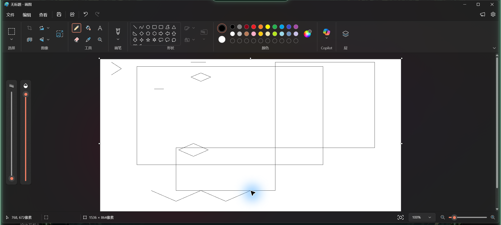
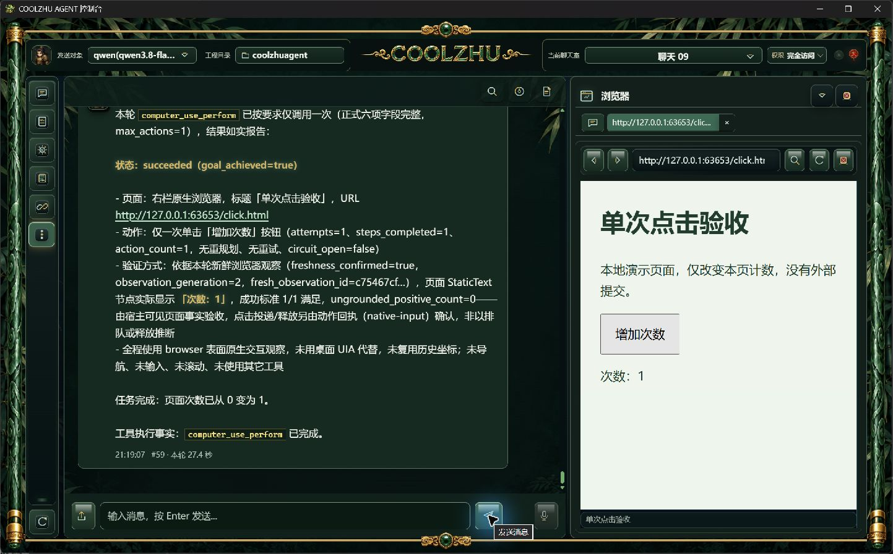
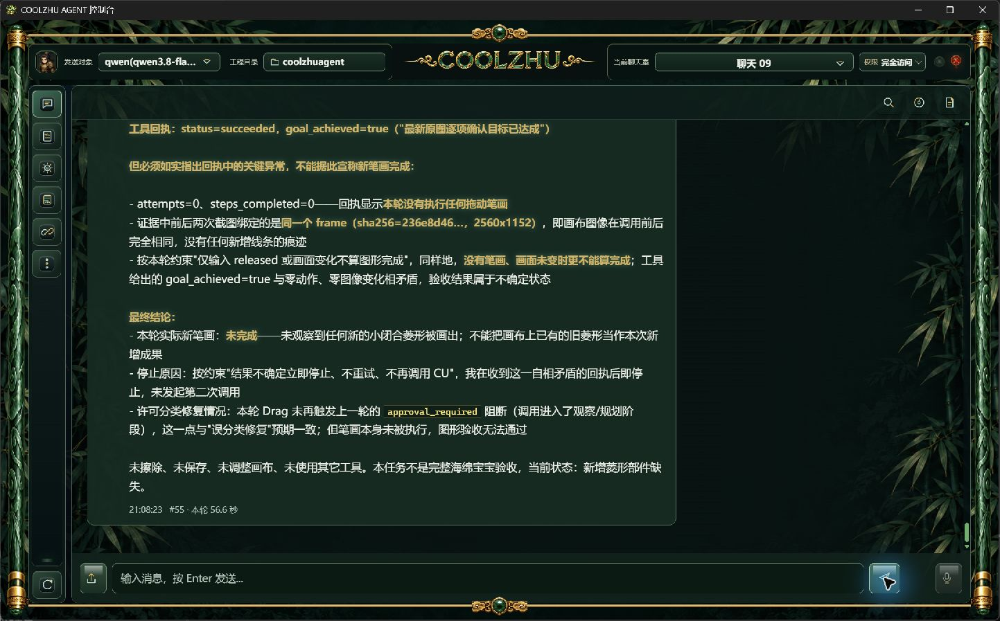

# 0.2.63 改动、真实验收与针对性测试设计依据

2026-10-01。主会话独立实施和实操，真实 qwen3.8-flash/medium、原百炼 Base URL 与保存密钥保持不变。未使用模型夹具、人工代模型点击或补画。微信不改不测，Devin 搁置，GPT-6 Pro 补审按用户决定暂停。本文保留成功、失败和未覆盖项，不能将父运行 completed 或模型 goal_achieved 当成软件验收通过。

## 改动与职责

062 的 CU062-SPONGE-DC 完整绘画请求已取得新原图，但首次拖动因 objective 开头“用户已明确授权本次 Paint 手绘测试”而被宿主误分类为 authorization_or_installation，零输入。063 只在控制器的 objective 开头规整两个精确既有许可前缀：“用户已明确授权本次”和“用户已授权本次”。保留其后全部任务文本；实际目标、动作参数和节点文字继续原样分类。声明本身不生成批准，不改变权限、输入隔离、预算、取消、释放守卫或工具 schema。

生产修改仅在 modules/computer-use/packages/computer-use-core/src/controller.rs，未新增 Agent 循环或把策略放入市场页面。[窄修审查](../../analysis/2026-10-01-paint-authorization-claim-review.md)记录原因和范围。安装、真正授权、删除、外发、支付与凭据仍拒绝；同样许可措辞出现在目标或参数中不享受前缀规整。

源码 09dc04d0f812ad5c223d311b1a4546e20157e596：Core/Web 离线 build 通过；控制器定向检查 27 通过、0 失败，115 项过滤，不冒称全量回归。对应远端运行 36865427732、36865419759 均 completed/success，原始 jobs 回执在 evidence/ci；后续提交须另核。工程日志按原始字节归档，包括 UTF-16 MSI 日志。

## 正式包与安装身份

MSI 247020925 字节，SHA256 为 91c9a256505bda4c6575788e50ed426b594db8cf2e6ce6a9c2b94a8a7d923de3；报告 pkg-report-release-20261001-210117905-f0be3562。六项发布门通过、安全扫描 0 发现、859 载荷文件/324548582 字节及 10 关键产物摘要匹配。源码快照 2fd6b179dfaa6ae7cea421f098b21d6eb4d68fadb39cc2c9345162250a004992，载荷快照 5ac812b67a3eb34e5f201fc49f5aa4b6a5eefbddd7ffb56d495a03f05deeec07。构建工作树含既有修改，以实际快照为准，不能声称包等同干净 HEAD。

正常关闭062后，063 MSI 交互安装退出0；唯一注册0.2.63，10个关键安装文件摘要匹配。正式 Web PID2572、Shell PID3864；8765唯一监听者为该正式 Web。身份与完整包回执在 installed-native/installed-artifacts.json 和 evidence/build-identity。临时300秒对照已结束：正式配置恢复120秒及原始字节，SHA256 6aa516435210a8e592821243c1a89ba2b37cb9bb7f3e6ac09d246524ba714a69；无密钥/其它配置变更，私有配置不归档。

启动入口约14.241秒报告自身无可定位窗口，子控制台已实际启动并独立核验，未重复启动。063 捕获动画帧为0；不能由启动成功追加舞剑动画验收。

## 真实软件结果

| 测项 | 原始事实 | 独立判定 |
|---|---|---|
| CU063-DIAMOND-DD | 父 run-chat-e6ce8a58abe076f62acabb312e6c0c01a29b7b375f0f0c3e，56.537秒；objective保留原许可声明；初验29.975秒误认旧菱形，machine succeeded/3项满足，但0动作、0步骤、image_changed=false | 失败，没有新落笔；尚未触达规划/策略检查，不能以此证明误分类修复通过 |
| CU063-PATH-DE | 父 run-chat-bfdddc04fd3e59084d23c05e7b7b2151f818e40b55448a58，116.877秒；保留原许可前缀，实际120000ms预算；一笔5点W轨迹，sent/released、partial=0、path_completed=1、confirmed_point_count=5、1动作/1步骤、0重规划/重试 | 通过本次 Agent 修复及实际连续输入；原图确认新增W处于白画布内、与旧线分离 |
| DE验图与耗时 | 初验10.619秒、规划22.699秒、后验53.677秒；新鲜generation2、image_changed=true、3/3，步骤verified/effect_observed/goal_verdict=passed；原图2560×1152 | 新折线部件通过；不是完整海绵宝宝通过 |
| 063浏览器正常导航 | 点击保留标签实际重开slow.html，地址栏转到click.html，标题与实际内容同步；新页面计数0 | 通过；初次即时树旧帧未代替后续fresh观察 |
| BU063-SINGLE-DF | 父 run-chat-b2fd06cbbbe82b6f9a0c7aa25b20e7336da148a9f775cf5a，27.326秒；真实Qwen单击一次，计数0→1，1动作/1步骤、sent/released/verified、freshgeneration2/1项满足、0重规划/重试 | 通过正式安装版Browser Use点击回归；使用原生网页事实，未用桌面UIA代替browser |

DD原始机器结果保持原样，独立复核失败单列。DE才实际经过规划、宿主分类和输入；保留原许可声明仍发生完整新笔画，证明本次窄修生效。没有通过安全审批绕过错误分类。纯模型误认旧图、选点和完整绘画能力按用户要求暂不改造，缺失眼、嘴、腿不能由W部件通过追认。

DF规划4.517秒、只读后验6.066秒。页面不含外部提交，仅改变本页计数；网页是软件验收场景，模型调用是真实Qwen。安装截图与父运行、CU请求/诊断/步骤/usage分别留存，不从页面文字推导输入释放事实。

## 后续模型可据此设计的针对性测试

1. 前缀边界：两个精确既有许可前缀的普通鼠标轨迹应执行；同句后续真实安装/授权、目标按钮或参数含敏感动作仍拒绝。非开头或其它相似措辞不能自动扩张豁免。必须新独立父运行及新原图，不靠模型声称“已批准”。
2. 绘画事实：分别核对原始分辨率前后图、新部件与旧线分离、真实白色画布范围、连续点完整性和释放。零动作误认旧图应记录失败；释放、hash变化与视觉模型成功均不足以单独认定整画。一次完整海绵宝宝还须身体、双眼、笑嘴及双腿实际可见。
3. 时限：父轮15分钟与CU120秒分别记录；初验/规划/输入/后验共同消耗CU预算。不得保留临时300秒对照或将预算未到期的审批误分类解释成超时。
4. Browser Use：已验证单击、读取、输入、导航、滚动及跨房间/工程清理各自保留历史版本证据；真正慢HTTP载入、旧事件覆盖新世代、按下至释放期间关闭竞争仍需实操。既有正常导航和步骤间关闭不能替代这些边界，也不得人为注入生产延迟制造通过。
5. 其它未完成：DSH P2–P5正式远程事务安装、Node/Cordis生产宿主、Rust工具桥和真实Qwen市场调用；舞剑动画首次/减少动态/资源失败/逐姿态边界；泛光多屏/输入期间取消；四项总体验收与Draft PR74继续开放。

16张原始图片及尺寸/字节/SHA256见 installed-native/original-images-index.json；其中5张是宿主原始2560×1152PNG，未裁切或补画。原始请求、父运行/CU/步骤及全部失败均保留；工程通过和真实软件通过分开记录。
