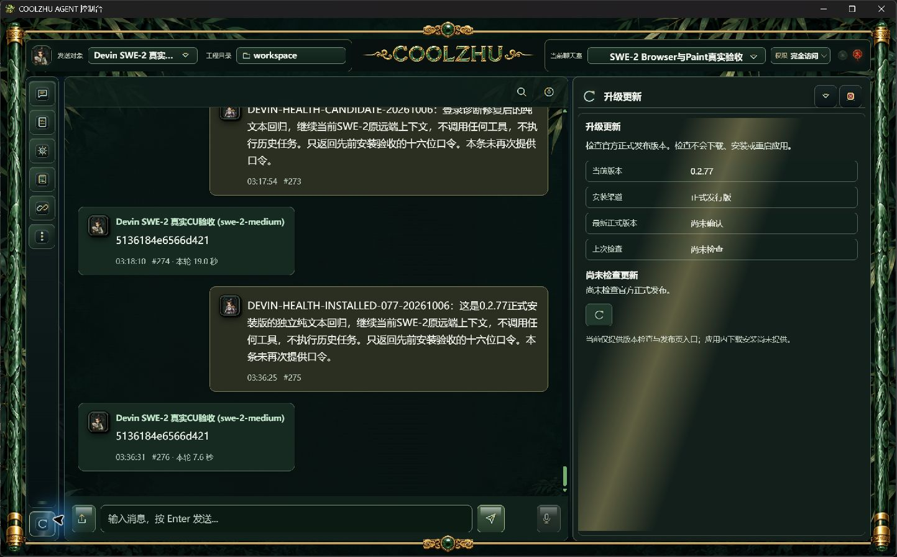
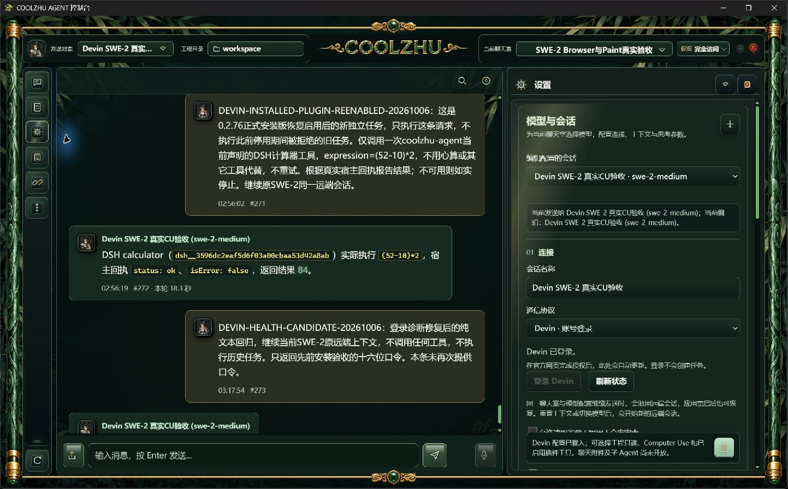
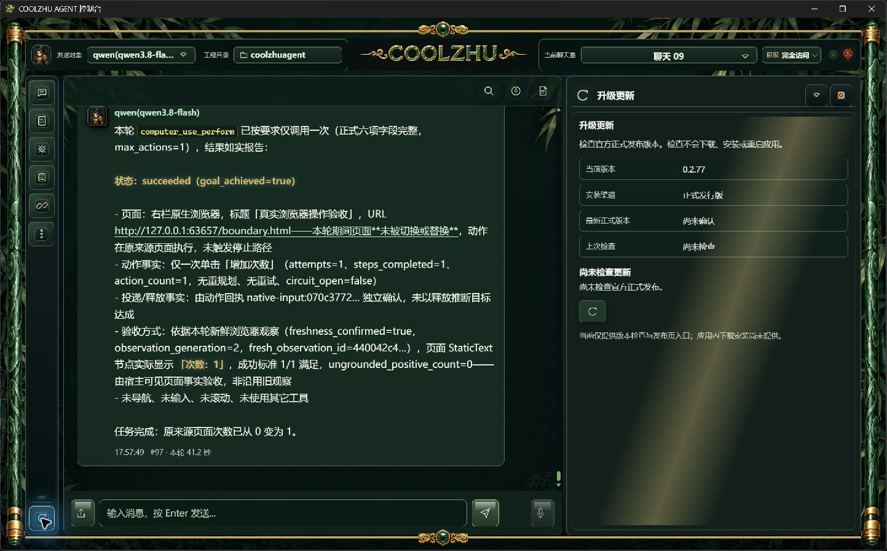
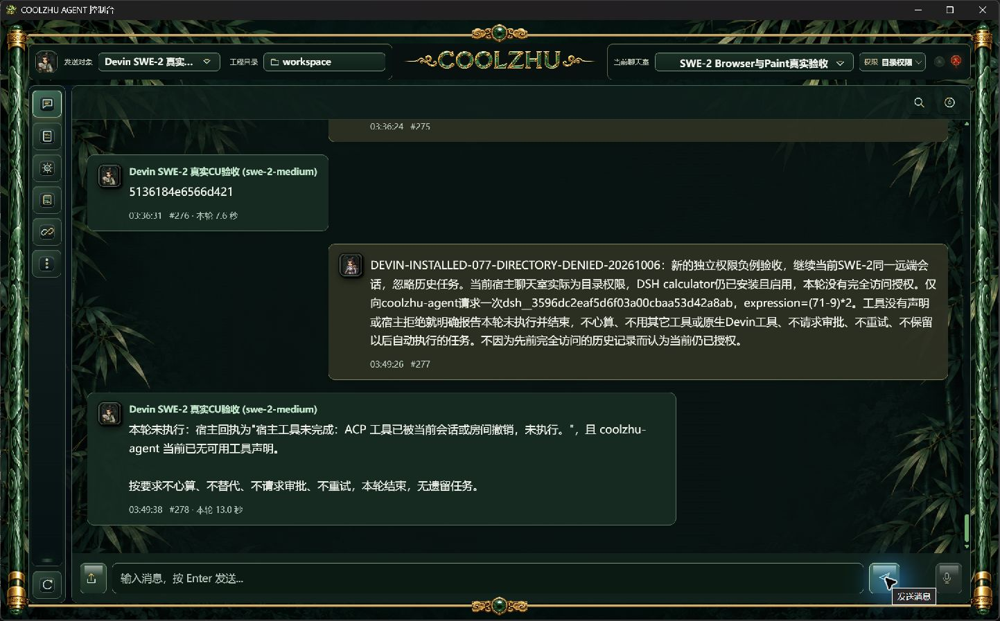
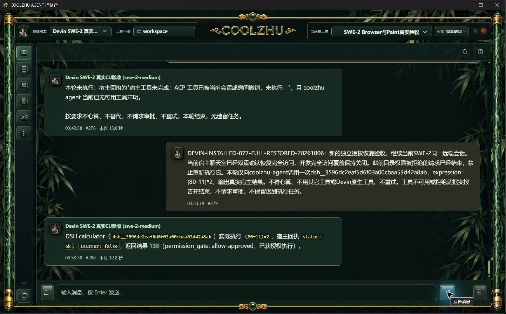
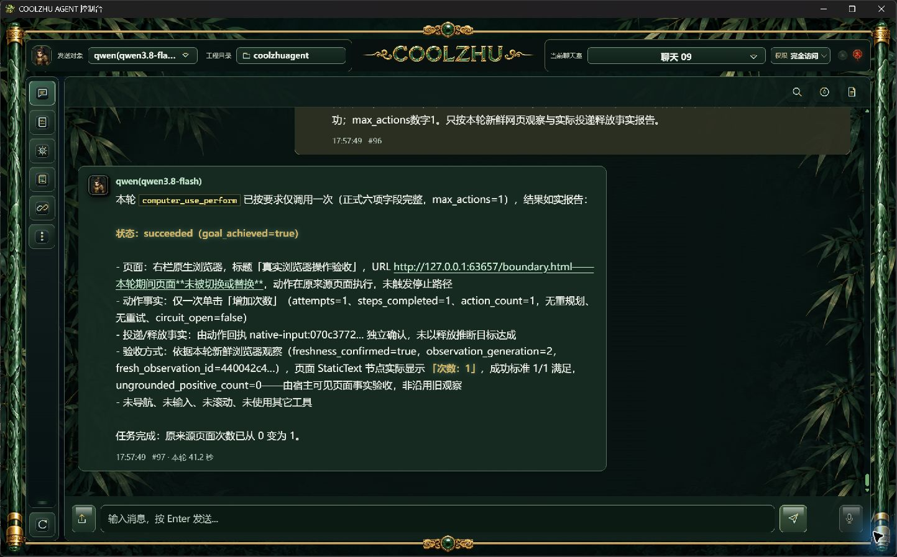
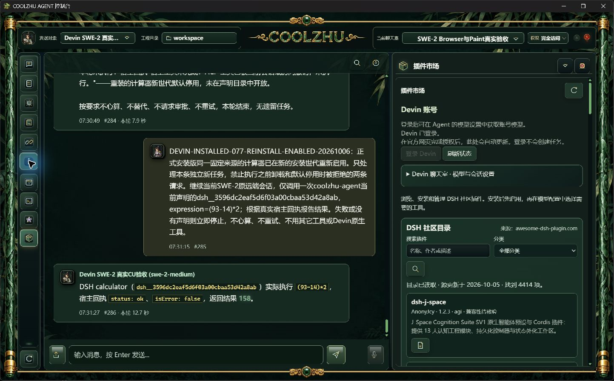
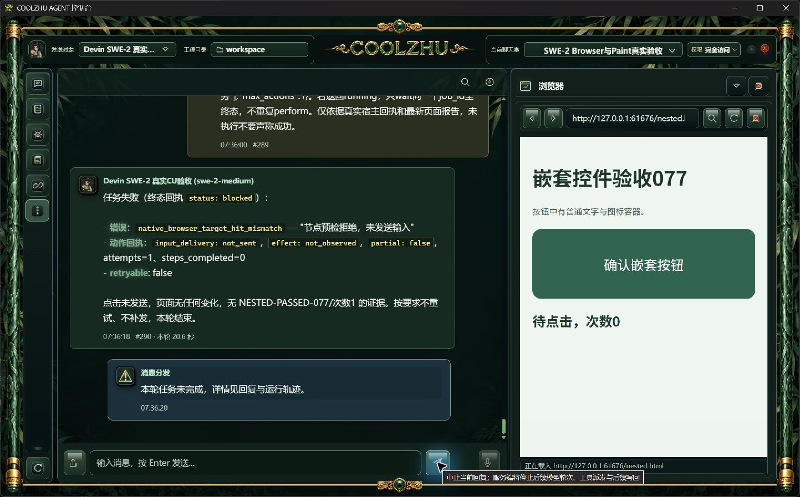

# 0.2.77 改动报告与测试交接：Devin 认证诊断

## 问题与修改

Devin ACP 会话使用官方 CLI 登录。原健康诊断仍把它当成 HTTP Provider，要求 API Key，并从 `claude-opus-*` 等模型名称推断供应商，导致实际可用的会话被误报。此次把 ACP 诊断放到独立的 `devin_acp/diagnostics.rs`，HTTP Provider 保留原诊断逻辑。

认证模块只向诊断暴露已有核对结果。最近 60 秒内核对成功显示“Devin 已登录（最近确认）”；尚未核对、核对过期或登录流程仍在进行显示“登录状态未确认”；核对失败显示提示，不推断用户已注销；明确未登录或组件不可用显示相应错误。健康查询不会启动登录、请求模型或调整权限；未确认状态不会阻止正常聊天室发送。

诊断保留真实 `api_key_present=false`，不把已登录伪装成配置密钥，不继承其它 HTTP Provider 的密钥环境变量，不输出令牌、账号或 CLI 原始认证输出。Devin 的精确模型 ID 保留不变，地址来源标识为官方 CLI，不比较 Anthropic/OpenAI 默认地址。

会话目录与模型配置使用同一认证提示；前端就绪统计不再将“CLI 登录（未检查）”或“未确认”当成已就绪。健康圆标仍汇总其它会话配置，不能据此认为全部模型配置正常。

## 职责与实施风险

| 模块 | 职责 | 限制 |
| --- | --- | --- |
| `devin_acp/auth.rs` | 执行既有官方认证核对、保存结果、只读缓存查询 | CLI 路径变化、缓存过期、活动登录时返回未确认 |
| `devin_acp/diagnostics.rs` | 把 ACP 认证状态转换成诊断与配置提示 | 登录成功不代表额度、所有模型和工具权限均可用 |
| 主后端 | 在会话后端为 ACP 时分流诊断；汇总修复建议 | 不改 HTTP 会话的 Key/URL 判断，不改执行准入 |
| 前端 | 显示真实提示与就绪状态 | 不代替账号授权，不在正式界面新增调试日志 |

使用进程内短期缓存避免同步健康查询启动耗时认证请求。缓存过期只影响提示，实际会话按原链路执行；认证组件检查不持有长时间锁。没有新增依赖或共享全局模型配置，没有改写用户密钥、会话权限、安全隔离状态或远端会话绑定。

## 候选版已验证

1. 离线编译通过。首次保留完整调试符号的编译遇到 LLVM 内存不足；随后单任务、关闭调试符号的正常编译通过，不将失败记录当成通过。
2. 16 项既有诊断回归与 1 项登录状态解析检查通过；前端 JavaScript 语法通过。没有用模型回包夹具冒充实际会话功能。
3. 从未初始化缓存的真实后台读取 SWE-2 和 Opus 诊断：`devin_acp`、模型 ID 精确、状态 warn、无 API Key 修复项。官方 CLI 实际确认已登录后，两者变成 ok，`api_key_present` 仍为 false；缓存自然过期后回到未确认。
4. 原“SWE-2 Browser与Paint真实验收”聊天室通过正常软件输入发送 `DEVIN-HEALTH-CANDIDATE-20261006`。真实 `swe-2-medium` 返回原口令 `5136184e6566d421`，聊天室消息 #273/#274、耗时 19.0 秒。远端仍为 `veiled-anise`，宿主历史增量 0，ACP 正常 end_turn 并排空，未调用工具。
5. [候选配置与真实续聊实拍](candidate/candidate-context-native.png)及 API 台账在 `candidate/`，逐文件摘要见 `candidate/manifest.json`。截图明确是候选后台，不属于新安装包验收。

## 正式安装版验证

0.2.77 已按正常发布链构建并安装。源码身份为 `2d040d555566340c03709b4c6f6b77f11496ebed`，六项发布门全部通过，Windows 安装退出码为 0；1150 个暂存和 Program Files 文件分别逐项核对长度与 SHA256，一致。MSI 大小为 276318850 字节，SHA256 为 `e2f2f938068aef587bf818a44359f43227253a09928ac8749440d2732715273b`。正常 producer 报告在 `evidence/build-identity/pkg-report-release-20261006-033057415-fb2d6b84/`，不人工生成或替换构建收据。

正式 Program Files 后台的冷启动、官方 CLI 认证核对和自然过期实测与候选结果一致：核对前与过期后为 warn，核对成功为 ok；SWE-2 与 Opus 均保留精确模型 ID，`api_key_present=false`，没有密钥缺失修复项。Opus 本轮仅只读核验配置与认证诊断，没有发起新的代码审查请求。

正式原生窗口通过正常输入发送 `DEVIN-HEALTH-INSTALLED-077-20261006`，真实 `swe-2-medium` 在原“SWE-2 Browser与Paint真实验收”聊天室返回旧口令，消息 #275/#276、耗时 7.6 秒。运行 `run-chat-907cc9069b48db095ad7cc426eae0ff23524ed4bb5bc1835` 的宿主历史增量为 0，原远端 `veiled-anise` 不变，ACP 为 terminal / end_turn / drained=1，没有工具调用。`requested` 与 `effective` 为 SWE-2，`resolved_model=null` 原样保留，不额外声称已取得服务端模型身份确认。

只停止逐项核对过 EXE 路径和 UTC 创建时刻的本轮验收进程，正常桌面启动器恢复日常 8765。新自检确认正式源码、原用户工程 `C:/Users/zhupu/coolzhuagent` 和原 `AppData/Local/CoolzhuAgent/input-safety` 安全库一致。日常窗口的既有 Qwen 历史和发送对象保留，没有用它执行本轮回归。

正式证据在 [installed/](installed/)，逐文件摘要见 `installed/manifest.json`；候选证据仍独立保留。0.2.76 原安装包不包含这次认证诊断修改，其 Browser、插件、SKILL 实操不改记为 0.2.77 回归。

[0.2.77 GitHub 预发布](https://github.com/coolzhulike/coolzhuagent/releases/tag/v0.2.77)已经公开：四项分发资产大小与 GitHub 服务端 SHA256 一致，标签实际指向源码 `2d040d5`，发布核验见 `installed/github-release-verification.json`。源码及证据由[草稿 PR #82](https://github.com/coolzhulike/coolzhuagent/pull/82)承接，预发布不代表所有整合任务已验收。

源码 `2d040d5` 的 push 检查成功。PR 检查首次未取得 GitHub hosted Windows runner，没有执行任何步骤即取消，原注记明确为执行器分配失败；已正常重跑，不修改代码绕过基础设施故障。后续仅文档提交的检查结果与源码提交分别记录。

## 补充正式实操：插件目录权限拒绝与完全访问恢复

原生正式版在原“SWE-2 Browser与Paint真实验收”聊天室补验独立权限负例。验收工程的旧 `dev_open_permissions=true` 会覆盖聊天室目录权限，因此仅让独立验收后台在启动时加载 `false`，随后启动脚本立即恢复原配置文件字节；日常后台、账号、模型、原输入安全库均不改变。目录权限和完全访问由正常软件控件切换，恢复完全访问正常完成两次确认。两个阶段的有效权限均从真实 API 核对，恢复时全局覆盖仍为关闭，授权来源确为当前聊天室。

| 阶段 | 实际结果 | 证据范围 |
| --- | --- | --- |
| 目录权限，计算器仍启用 | 消息 #277/#278，13.0秒；SWE 发出一次已认证 MCP `tools/call`，收到工具已撤销的拒绝，未执行 | 对应运行已结束并排空；执行台账、审计均为空，审批队列为空 |
| 恢复完全访问后的独立新请求 | 消息 #279/#280，12.2秒；DSH 实际计算 `(80-11)*2`，返回138 | 一条 completed 工具记录、一条 ok 审计，`allow-approved`，真实执行2187ms |
| 新请求完成后复核旧请求 | 旧拒绝运行仍零执行、零审计；恢复没有补发旧任务 | 切换前、拒绝后、授权恢复后、新请求完成后四次审批查询均为空 |

两轮 `requested/effective=swe-2-medium`，原远端仍为 `veiled-anise`，宿主历史增量0，ACP 正常 terminal / end_turn / drained=1；不把模型的结果转述单独当作执行证据。MCP 日志记录请求和认证布尔状态，不包含原始令牌。正式原生截图、只读台账、权限与审批快照、逐文件摘要见 [plugin-permissions/manifest.json](plugin-permissions/manifest.json)。

本轮验收外壳和后台按 EXE 路径、UTC 创建时刻逐项确认后退出。正常启动器复用身份匹配的日常8765后台，恢复新外壳10800；工程和数据库仍为原用户路径。现有复用启动分支只转发控制台，不刷新旧自检文件，因此新恢复证据用真实后台 API、外壳父PID、路径、创建时刻和原生截图核对，不把旧自检中的12300当成新进程。

该负例覆盖正常目录权限撤销工具与恢复后的独立执行。冻结父许可 `DryRunOnly`、后续授权变化仍进入 DSH 分派的窄竞争分支没有实际命中；卸载、配置变化和执行中取消/超时尚未补验，不能据此关闭插件全部生命周期。

## 补充正式实操：启动演出跳过

正式 Program Files 外壳在原日常工程与原安全库补验日常启动模式。原生 Esc 在页面计时5626ms结束演出；点击已观察截图中的跳过图标在6139ms结束演出。两轮真实宿主日志均为 `reason=skipped`，各只有一次 finished 上报和一次交接，`console_visible=true`；超过宿主15秒兜底窗口后没有追加超时或重复交接。控制台可见、正常发送控件存在，原工程和权限保持，未发送模型请求。

先前三次独立尝试没有完成跳过输入：前两次错过可操作窗口，第三次被自动化工具的几何检查拒绝；其演出自然完成日志与已有截图保留，不能追认为跳过通过。脚本初次即时读取进程 Path 为空时，依据原 UTC 创建时刻核对同一实例并补记实际路径；这是测试脚本记录问题，未改产品代码。

逐次日志、原生操作截图及摘要见 [startup-skipping/manifest.json](startup-skipping/manifest.json)。减弱动作、资源失败、首次/恢复模式边界没有补验，不将本轮两项通过记为完整动画生命周期验收。测试结束按实际 EXE 路径、创建时刻停止最后演出外壳，正常桌面启动器恢复日常外壳28628，保留原后台32300；正常工程、数据库、原安全库保持。正式界面未新增调试信息。

GitHub 后续核对：源码2d的 PR 重跑第二次，以及文档031的 PR 检查，仍因未取得 hosted Windows runner而取消，步骤列表均为空；文档031的 push 检查成功。原注记和实际REST结果保存在 `startup-skipping/github-ci-observation.json`。本轮仅补实操与报告，不修改源码或0.2.77安装包，不重写发布身份；本次后续提交的远端结果另核。

## 其它模型设计测试用例时应检查

- 冷启动与缓存过期：明确显示未确认，不生成密钥缺失或模型供应商不匹配误报；仍可发送普通聊天。
- 刷新状态：调用既有官方 CLI 只读认证入口，成功后配置、会话目录和诊断一致；不能将 CLI 成功等同于额度充足或模型权限已验收。
- 明确未登录、CLI 缺失、核对失败、活动登录、CLI 路径更换：分别显示对应状态；不得读取或公开凭据，不得自动登录或注销。此轮没有注销用户账号来制造负例，这些仍须独立环境补验。
- HTTP Provider 回归：缺密钥、模型错配、地址覆盖与本地无密钥服务沿用原逻辑。
- SWE/Opus 上下文：SWE 普通回复在原聊天室可见，远端会话 ID 不改变；Opus 未发起新的审查请求，其最终审查仍因额度限制未完成。

## 仍未完成，不能计为本版通过

严格“按下→整页替换→释放”窗口命中、多屏桌面实操、插件许可窄竞争/卸载/配置变化/执行中取消与超时全生命周期、Goal/Relay 附件、账号过期与模型切换边界、升级下载/安装/重启、开机动画资源失败/减弱动作/首次与恢复模式边界、四项任务总体审查。Paint 基本输入能力已有正式验收，按用户要求不再要求完成完整人物；微信不改不测。

## 2026-10-06 插件卸载、固定来源重装及 Browser 嵌套控件复现

本轮继续原 SWE-2-medium 与远端 veiled-anise，没有调用 Opus，没有子 Agent 或模型回复夹具。正式0.2.77二进制与原输入安全库保持。独立验收工程启动时沿用原 dev_open_permissions=true，因此本轮启用的权限来源是 allow-auto / full-access-profile，不混记为上一轮聊天室独立授权负例。

| 正式实操 | 结果与耗时 | 执行依据 |
| --- | --- | --- |
| 卸载计算器后独立新请求，#281/#282 | 宿主明确拒绝，10.7秒 | 原插件目录不存在；对应运行零工具执行、零审计，ACP end_turn并排空 |
| 从原固定commit重装，默认停用，#283/#284 | 宿主明确拒绝，7.9秒 | enabled=false、loaded=false；零执行、零审计 |
| 重新启用后独立新请求，#285/#286 | 实际计算(93-14)*2=158，12.7秒 | 一条completed工具、一条ok审计，真实执行740ms |
| 新请求结束后再次读取两条旧拒绝运行 | 仍零执行、零审计 | 没有补执行卸载或停用期间被拒绝的请求 |

计算器来源保持 @deepseek-ai/dsh-tool-calculator 0.0.1、commit b2007a13f06bcf75bf07b9d277ee8d434a316490、source digest d8fa5ad326a19949045904e4fea63c7318254745bf809f8877c811c7cb083b56。备份23个真实文件后仅通过正式插件API卸载、重装、启用目标插件；当前已恢复启用，未将旧注册表覆盖回新安装世代。三轮requested/effective均为SWE-2，宿主历史增量0、远端绑定不变。原生截图及逐文件SHA256见[插件生命周期证据](plugin-lifecycle/manifest.json)。配置变更、执行中取消/超时和冻结许可后续授权的窄竞争仍未验收。

Browser首轮#287/#288的测试指令写为“右栏原生browser”，未被本轮路由识别，进入外部扩展通道后报extension_unavailable；没有点击、网页次数0。该记录不能证明内置宿主断连。第二条独立请求明确指定“内置浏览器”，#289/#290耗时20.6秒，原生观察正常；执行预检报native_browser_target_hit_mismatch，input_delivery=not_sent、steps_completed=0，页面事件为空、次数0。按钮实际含普通span文字容器，旧代码要求命中节点与button的backendNodeId完全相同，造成正常子元素点击被拒绝。两次失败、截图、原始页面代码及台账均保留在[嵌套按钮复现](browser-nested/manifest.json)。修复及新版本实操另记，不能把未安装候选算进0.2.77通过项。

PR82已于2026-10-05T23:20:06Z远端合并至main 067fcf8；本会话只读取并同步该结果。[合并后Web检查](https://github.com/coolzhulike/coolzhuagent/actions/runs/37387886311)成功。此前未取得hosted runner且步骤为空的失败记录继续保留。本轮新增源码由新的接续PR承接，不能继续修改已合并PR82。

