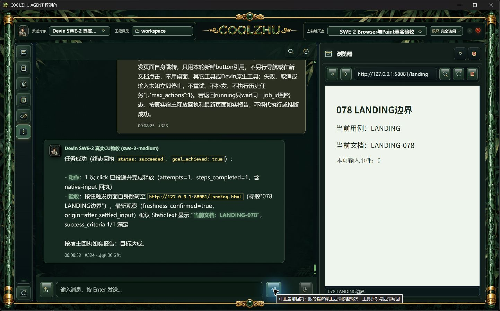
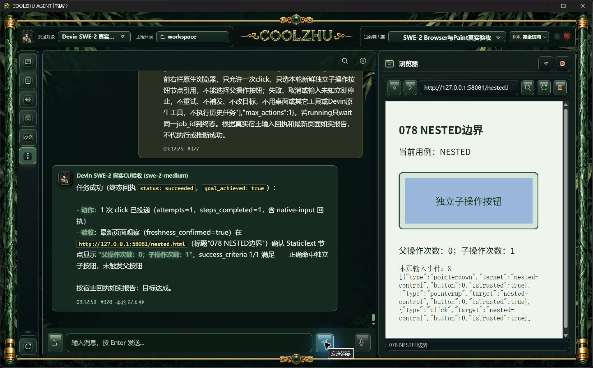
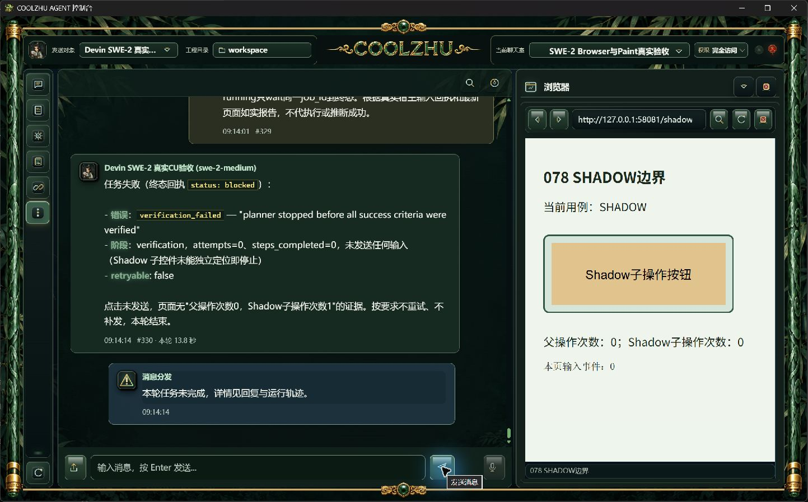

# 0.2.78 Browser Use复杂控件与资源边界补验（2026-10-06）

本轮继续原SWE-2-medium、聊天室room-1791131523339、Agent session-1791131217833和Devin远端veiled-anise。主会话准备测试网页和发送任务，目标点击全部由真实模型调用coolzhu-agent工具完成，无模型回复夹具、无子Agent、无受限Opus。requested/effective均为swe-2-medium，resolved_model仍为null；不据此推断供应商最终模型解析。

正式安装版源码仍为0b97366c7fde8d284c122ab7ec9754c742092bb5。先核对Program Files两EXE摘要，再在原验收工程/安全库运行。正常产品源为8765；早期8767实验及撤回的地址同步候选单独标记，不能代替正式默认入口验证。

| 场景 | 消息与耗时 | 实际事实与结论 |
| --- | --- | --- |
| 父按钮中心覆盖独立普通子控件 | #307/#308，21.6秒 | hit_mismatch，not_sent/not_needed，父子次数0；预期拒绝通过 |
| 父按钮中心覆盖开放Shadow内子按钮 | #309/#310，28.7秒 | hit_mismatch，not_sent/not_needed，父与Shadow次数0；预期拒绝通过，不能当内部自动化通过 |
| 顶层父控件中心覆盖iframe子文档 | #311/#312，22.3秒 | hit_mismatch，未输入；子框架能渲染。中心实际是子文档标题，不是子按钮；不声称iframe按钮已验 |
| 按下触发跨URL导航 | #313/#314，27.7秒 | 一次点击并释放，最终LANDING-078；新文档ready在pointerup之后，严格按下与释放之间提交新文档的竞态未命中 |
| 观察后试图关闭面板，两次实验 | #315/#316，28.4秒；#317/#318，28.6秒 | 点击均先完成，UI关闭晚于输入；两次都不能记为关闭前零输入通过 |
| 默认8765，页面自身跨URL导航 | #323/#324，30.6秒 | 一次click、released、freshness_confirmed；地址栏与页脚已同步landing.html及新标题，正式入口正常 |
| 发任务之前已关闭面板 | #325/#326，12.2秒 | native_browser_panel_unavailable，attempts0/steps0；不重开、不切换表面、不补发，初始关闭负例通过 |
| 明确选择普通独立子按钮自身 | #327/#328，27.6秒 | 一次真实click/released，父0、子1；嵌套子控件正例通过 |
| 明确选择开放Shadow子按钮自身 | #329/#330，13.8秒 | verification_failed，attempts0；页面能显示但子控件无操作引用，这是实际能力缺口，交由0.2.79候选修复，不能追认0.2.78成功 |

## 地址栏实验的排除结论

8767来源不在当前Tauri远程event.listen权限配置内，导致页面自身导航的异步地址显示没有更新；未修改的正式8765反证证明产品正常。曾准备的地址同步源码候选已撤回，没有为这一实验误判修改产品或发行安装包。

混用Program Files后台和临时目录外壳的#319/#320（18.0秒）被同目录进程身份校验拒绝，输入0；同目录候选#321/#322（55.5秒）能正常点击导航，但仍受8767事件环境影响。这两轮保留原结果，不算正式入口通过，不放宽EXE身份或远程权限。

## 证据与测试交接

软件原图、任务正文、真实模型/工具/输入台账与逐文件摘要见[证据清单](browser-boundaries/manifest.json)。网页事件按本轮source_message.created_at与case筛选，整个服务器ledger含之前轮次，不能笼统报全部事件0。Shadow事件在顶层document记录的target会重定向为shadow-host；子按钮自身监听的shadow-click及父/子计数才用于确认实际子点击，不能只按顶层target文字判断。

补验仍开放：iframe内部自动化、跨URL新文档在down/up之间提交的严格时序、观察后/按下期间关闭或替换面板。不能用渲染、初始关闭、拒绝父控件误点击或点击后导航替代这些验收。

原始watch文件在第二轮关闭实验被固定同名覆盖，只保留现存一份；早期正式stdout/stderr临时文件被候选覆盖，未列为完整证据。实际模型任务与CU台账、各轮独立截图仍保留。本报告明确这些证据限制。
