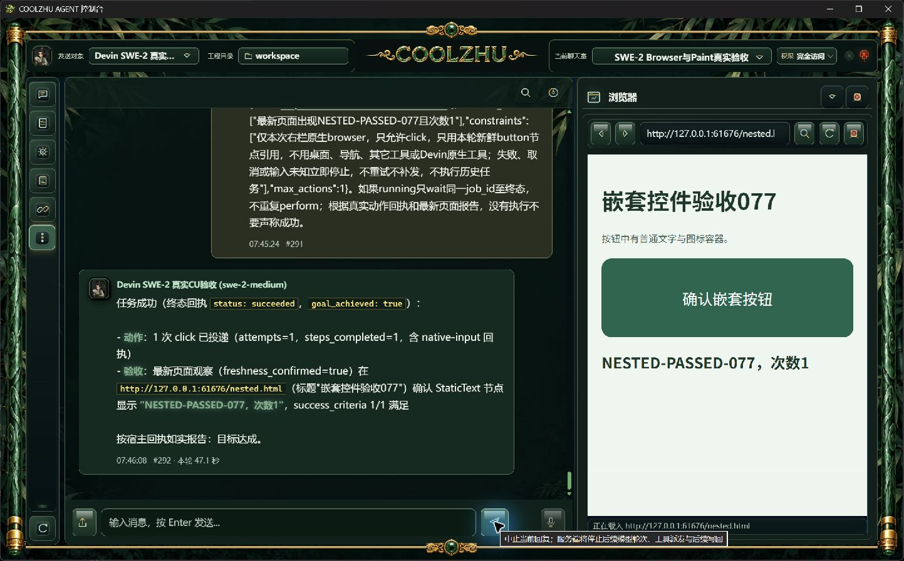
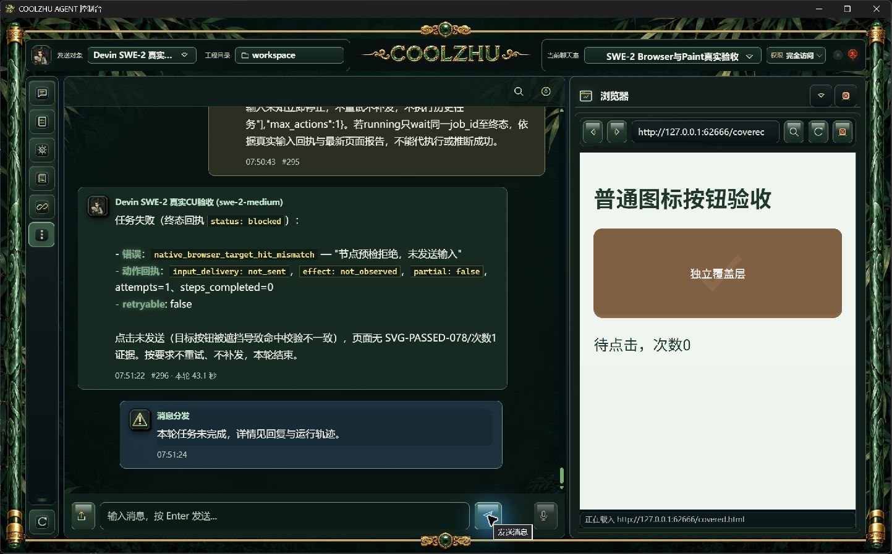
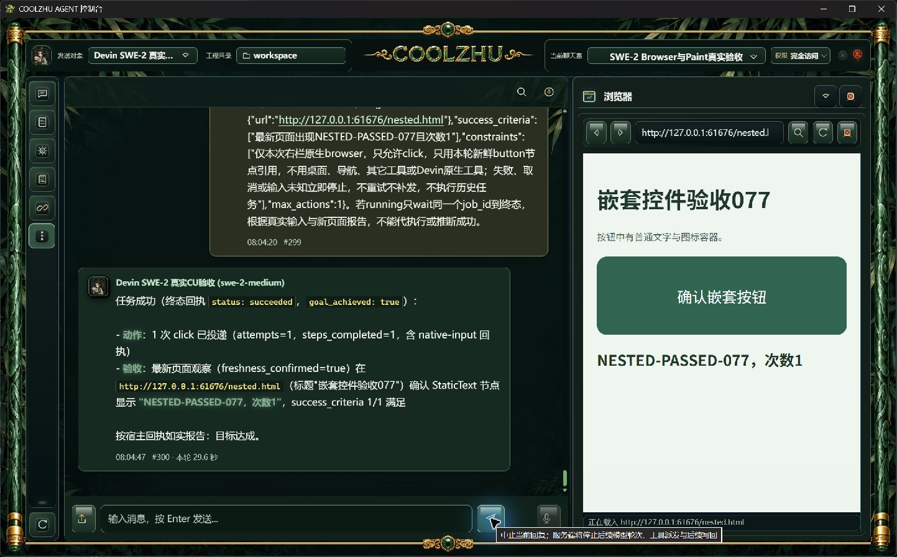
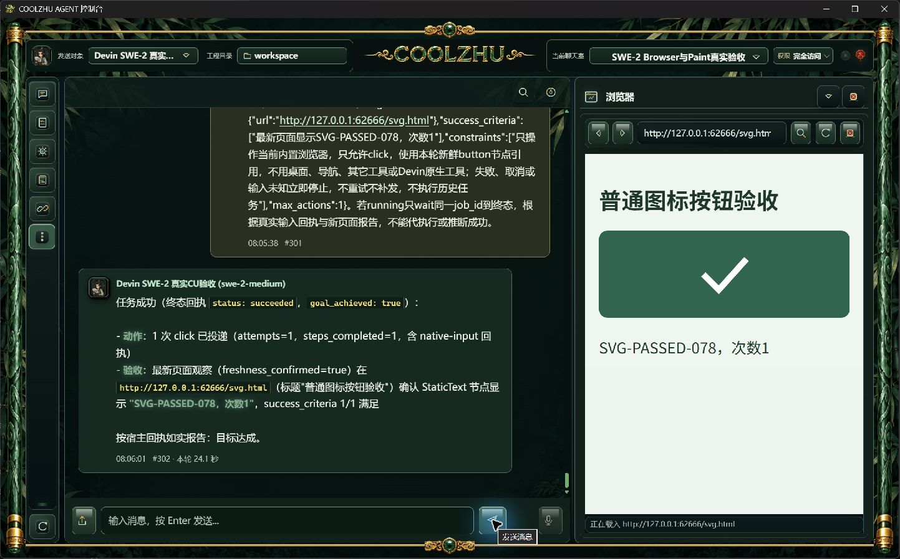
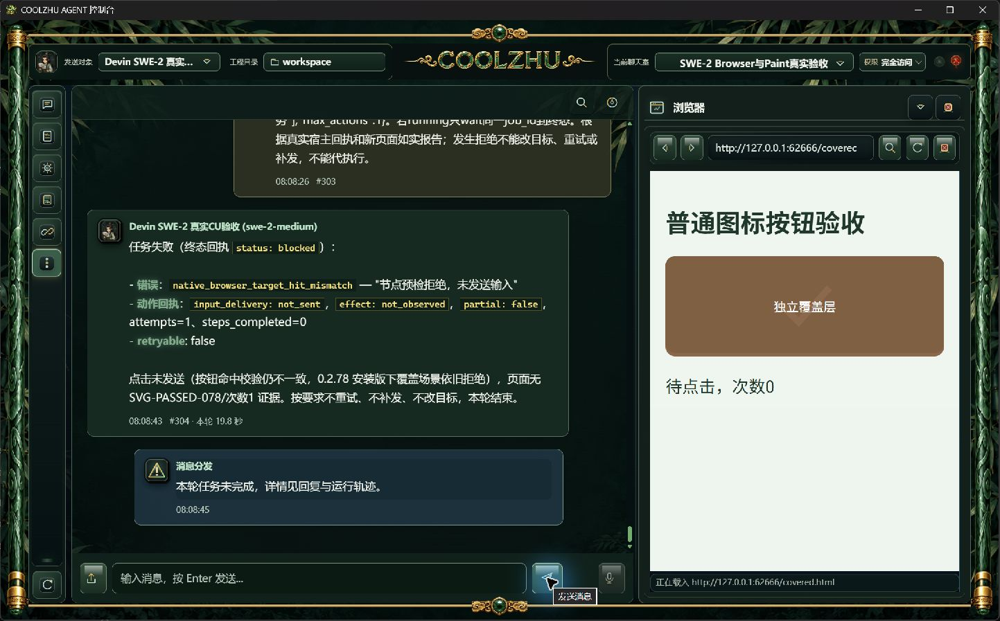
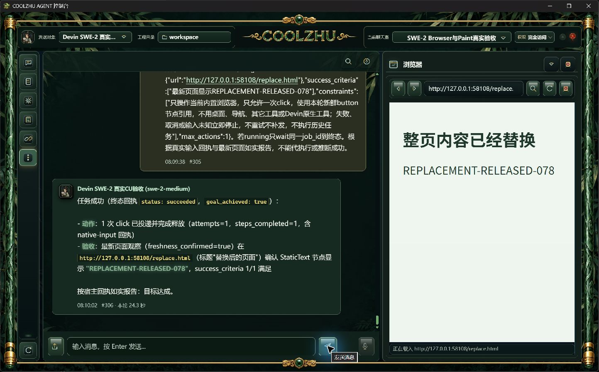

# 0.2.78 改动报告与针对性验收交接

## 问题与行为变化

正式0.2.77实操发现两个阻塞：用户写“右栏原生browser”时误走外部浏览器扩展，报extension_unavailable；明确指定内置浏览器后，按钮内部普通span命中仍被native_browser_target_hit_mismatch拒绝。原始失败、页面次数0与截图继续保留在[0.2.77复现证据](../release-0.2.77/browser-nested/manifest.json)，不能追认为旧版通过。

本版在既有当前用户指令范围判定中加入四种中文与browser混合表述。宿主点击核验接受原button普通DOM子树内的文字或SVG命中，保持原节点绑定；重新读取命中后的DOM核对祖先关系，不把子元素引用变成新授权。独立覆盖层、其它交互控件、iframe和shadow边界继续拒绝。文档、框架、控件身份、几何、原生面板资源及预检时限仍由原模块核对。

代码改动仅涉及`computer_use_turn_scope.rs`与`native_browser_target.rs`，没有向正式界面增加调试控件。发布源码为0b97366c7fde8d284c122ab7ec9754c742092bb5；后续证据文档提交不改变该安装包源码身份。

## 真实模型候选验收

继续原聊天室room-1791131523339、SWE-2-medium与远端veiled-anise；未调用Opus，未使用子Agent或模型回复夹具。主会话只准备右栏网址和发送测试任务，目标按钮由真实模型调用coolzhu-agent工具执行。工程沿用原输入安全库及dev_open_permissions=true，不混记为聊天室独立审批负例。requested/effective均为swe-2-medium，resolved_model=null原样保留，不声称已得到供应商最终模型解析信息。

| 场景 | 消息与耗时 | 实际结果及验收依据 |
| --- | --- | --- |
| 右栏原生browser表述＋button内span | #291/#292，47.1秒 | succeeded，一次click；网页记录命中label的pointerdown/up/click，次数1；宿主released、freshness_confirmed=true |
| button内SVG图形 | #293/#294，51.7秒 | succeeded，一次click；网页记录命中glyph的完整事件，次数1；宿主released、最新页面目标达成 |
| 独立覆盖层遮挡button | #295/#296，43.1秒 | 预期拒绝：blocked、hit_mismatch、not_sent、not_needed；covered页面事件0、次数0，没有重试补发 |
| 按下时同步整页内容替换 | #297/#298，56.0秒 | succeeded；真实事件先original-pointerdown、再replacement-ready、再replacement-pointerup；新页面显示REPLACEMENT-RELEASED-078，宿主released |

遮挡轮模型任务未成功，但安全负例符合预期，不能把blocked改写成任务成功。第二个页面服务器含先前SVG事件，负例按`case=/covered.html`筛选，不能将全服务器事件误报为0。首个正例同步了上一失败轮的一条历史增量；之后两轮增量0，远端会话保持不变。台账、原生截图、真实网页事件与SHA256见[候选证据目录](candidate-browser/manifest.json)。

内容替换轮同步前一失败轮一条历史增量，远端保持veiled-anise。网页通过pointerdown监听器同步document.open/write/close替换整个HTML，不修改宿主源码，也不延迟/注入宿主输入。实际页面计时1791244566274.3→6281.8→6284.3ms，证明替换内容已就绪后才收到pointerup。该项关闭同步整页内容替换的候选时序缺口；跨URL新文档导航竞态仍未实际命中，不混记通过。执行中原生截图还记录了使用电脑提示，终态提示收起。

## 工程验证与正式安装验收

Web和Tauri外壳均完成离线cargo build。Web既有全量检查1390通过、6忽略，库8通过、启动bin1通过；外壳66通过。范围判断8项和原生目标3项专项检查通过；这些工程检查不替代真实模型实操截图。日志收录在候选证据目录。

0.2.78已由正常发布链构建并正常Windows管理员安装，msiexec退出0；六项发布门、冻结源码前中后三次稳定核验及1150个Program Files安装文件逐项长度/SHA256核验通过。MSI为276335234字节，SHA256为ac51b3589d3cefcb440237a28d11a09a40203dbc68925a3b27d608316ddb05ab。生产者原字节收据位于[evidence/build-identity](evidence/build-identity/)，源码快照1f3cba957ad6d9da031894b8ba02339de3e6a6cd99f27489ca8eb00b2fe75bd7保持不变。产物库存vcs.dirty=false，后续MSI报告dirty=true来自构建期间新增的文档/证据，不在该源码快照范围内；两份生产字段原样保留，不篡改成一致。

随后使用Program Files真实Web与外壳、原测试工程和输入安全库、同一SWE远端veiled-anise复测，四项均取得独立软件原图与宿主结果：

| 正式场景 | 消息／耗时 | 正式验收结果 |
| --- | --- | --- |
| 混合指令＋普通span按钮 | #299/#300，29.6秒 | 一次click，label的down/up/click各一次，次数0→1；sent/released，最新页面目标达成 |
| 普通SVG图形按钮 | #301/#302，24.1秒 | 一次click，glyph的down/up/click各一次，次数0→1；sent/released，最新页面目标达成 |
| 独立覆盖层遮挡 | #303/#304，19.8秒 | blocked/hit_mismatch，not_sent/not_needed，该轮covered事件0、次数0；模型没有重试、补发或改目标 |
| 按下时同步整页内容替换 | #305/#306，24.3秒 | original-pointerdown 1791245392853.9001ms→replacement-ready 2854.5ms→replacement-pointerup 2857ms；替换后释放，最新页面REPLACEMENT-RELEASED-078 |

正式工具台账每轮一次，前三轮历史增量0，最后一轮正常同步前一失败的一条增量，远端不变；每段ACP均terminal/end_turn并排空。遮挡轮父任务failed，用户聊天室仍显示真实模型回复；它是预期拒绝通过，不是模型目标成功。原始服务器保留候选事件，正式结果按当前消息创建时刻与页面case筛选，不能重复算旧事件。[正式证据与摘要](installed-browser/manifest.json)包括真实Program Files进程绑定、安装产物身份和四张终态截图。

测试进程均结束后，按本轮EXE与UTC创建时间收据停止自有验收实例，通过正常桌面launcher恢复日常8765；新自检ok=true，实际Program Files进程、源码0b、原日常工程和原输入安全库一致。[恢复证据](daily-restoration/manifest.json)。日常原发送对象仍为用户原配置Qwen，未用其执行本轮验收；SWE实操全部留在独立验收工程原聊天室。安全库读取状态safe/accepts_new_input=1，历史outcome_unknown两条仍保留，所有资源block已closed；没有清安全库或伪造旧输入终态。

验收启动脚本曾因路径分隔符和PowerShell日期时区解析产生记录失败；实际两只Program Files进程已正常启动，修正临时记录脚本后按实际EXE、父PID与UTC窗口重新核验，未把该脚本失败伪称产品启动失败或删掉记录。正式测试pair直接使用已安装EXE，正常launcher恢复另行独立验收。

源码0b的[PR检查](https://github.com/coolzhulike/coolzhuagent/actions/runs/37391024388)与[push检查](https://github.com/coolzhulike/coolzhuagent/actions/runs/37391010902)均success、实际Windows步骤非空，原始结果见[evidence/source-ci.json](evidence/source-ci.json)。后续报告HEAD与发布资产另核，不从源码CI推断后续提交。

[0.2.78 GitHub预发布](https://github.com/coolzhulike/coolzhuagent/releases/tag/v0.2.78)已公开，MSI、安装报告、安全报告和MSI摘要四个资产的服务端长度/SHA256全部与本地一致；真实标签指向源码0b。安装包也已交付到用户桌面dist目录。完整远端核验见[evidence/github-release-verification.json](evidence/github-release-verification.json)；预发布不等同于四项整合任务全部验收完成。

## 其它模型可据此设计的针对性测试

- 正常button文本容器及SVG图形：只发送一次工具请求，观察真实宿主sent/released和网页一次pointerdown/up/click，不仅检查模型总结。
- 中英混合指令：检查仅当前用户表述路由到内置面板，历史内容及模型参数不得自行扩大范围。
- 真实独立覆盖层：必须not_sent，页面无该轮事件，模型不得失败后补发或改走桌面/其它浏览器。
- 嵌套交互角色、tabindex、contenteditable、iframe、shadowRoot：工程检查覆盖拒绝判断，尚未全部做真实模型页面实操，保留验收缺口。
- 页面或面板在观察后变化：同步整页内容替换已在正式版证明；跨URL新文档导航仍需独立时序证据，关闭/替换面板、失焦等独立边界，不能由普通按钮通过推断这些均已通过。

## 当前仍未完成

跨URL新文档导航的严格按下→导航→释放、多屏桌面、插件配置变化与执行中取消/超时及冻结许可竞态、Goal/Relay附件、账号过期与模型切换、自动升级下载安装重启、开机动画资源失败/减弱动作/首次恢复边界、四项任务总体审查。插件卸载→固定来源重装默认停用→重新启用已在正式0.2.77补验；[记录](../release-0.2.77/plugin-lifecycle/manifest.json)不等同于全部插件生命周期完成。Paint基本输入已有正式验收，按用户要求不再要求完成完整人物。微信不改不测，Opus本轮暂不使用。
