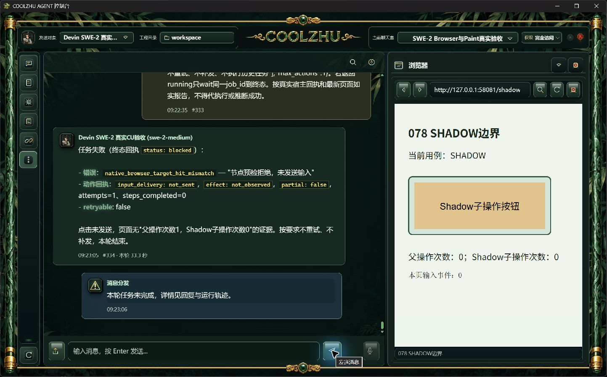

# 0.2.79 开放Shadow Root点击修复与针对性测试交接

## 问题与最终实现

0.2.78正式默认入口的真实SWE #329/#330中，开放Shadow Root内部按钮可见，但没有独立操作引用，最终verification_failed、attempts0，父子次数均0。这是Agent侧观察能力缺口。[原正式失败及其它边界报告](../release-0.2.78/browser-boundary-followup.md)保留，不能由后续候选成功追认为旧版通过。

宿主固定只读DOM.getDocument节点采样启用pierce；一个独立的小模块native_browser_dom负责筛选普通children和明确标记为open的Shadow Root，仍不进入contentDocument、封闭/UA Shadow Root或伪元素。开放根内AX控件按实际backendNodeId绑定原顶层文档身份；执行前继续核对文档、角色/名字、交互状态、几何、命中点、面板资源和期限。目标归属核验进入Shadow Root时切断父控件的继承资格，必须独立选择内部控件自身的本轮新引用。

这次仅关闭开放Shadow控件点击缺口，不宣称Shadow文本编辑、键盘、封闭根或iframe内部自动化已通过。采样仍有深度、2048节点和响应长度上限；截断或无法确认的目标不提供部分许可。没有增加正式UI调试控件，也没有放宽安全隔离、同目录EXE身份、用户权限或输入释放规则。

协议字段按[Chromium官方DOM定义](https://github.com/ChromeDevTools/devtools-protocol/blob/master/json/browser_protocol.json)核对：pierce会同时展开iframe及Shadow Root，因此宿主必须另行筛选允许绑定的同文档开放根，不能把读取能力视为跨文档输入许可。

## 候选真实模型验收

原聊天室room-1791131523339、Agent session-1791131217833、Devin远端veiled-anise保持。requested/effective=swe-2-medium，resolved_model=null原样保留。不用Qwen、Opus、子Agent或模型回复夹具。候选在默认8765运行同目录新构建后台/桌面壳，沿用原工程与真实安全库。

| 独立任务 | 消息／耗时 | 实际证据与结论 |
| --- | --- | --- |
| 明确选择Shadow子按钮自身 | #331/#332，54.8秒 | 一次click、steps1、sent/released、freshness_confirmed；父0、Shadow子1；pointerdown/up/click均trusted，子监听shadow-click=1。正例通过 |
| 指定父按钮，中心被Shadow子控件覆盖 | #333/#334，33.3秒 | hit_mismatch、not_sent/not_needed、steps0；父0、子0、当轮输入事件0。预期拒绝通过，模型目标未达成且不重试/补发 |

顶层document事件target在Shadow边界重定向为shadow-host；不能误报为直接操作了宿主。子监听、独立计数、宿主绑定与实际动作回执共同确认子按钮点击。[原图、台账、源码文件摘要与进程配对](candidate-shadow/manifest.json)。每段ACP均terminal/end_turn并排空。

桌面壳离线cargo build与既有69项检查通过；新增检查限定开放根引用、重复/超预算拒绝和独立目标归属。它们用于代码边界回归，不替代真实模型软件截图。Web业务没有在本次Shadow修复中改动。

## 正式安装验收与后续测试

当前本节等待正常发布链构建、安装文件摘要核验及正式SWE同一会话复测，不能把候选目录二进制计为Program Files正式通过。

后续测试优先级：正式安装版重复上述正/负例；再按独立文档身份方案处理iframe内部自动化，保留跨URL新文档严格down/up时序和观察后/按下中面板关闭或替换缺口。已完成普通span/SVG、嵌套交互正/负例、普通覆盖层拒绝、同步整页内容替换释放、正常跨URL导航和初始关闭负例；这些不能替代窄时序验收。完整四项任务尚未全部验收，Paint按用户缩减范围仅验基础输入且已有正式通过，微信不改不测，Opus暂停。
