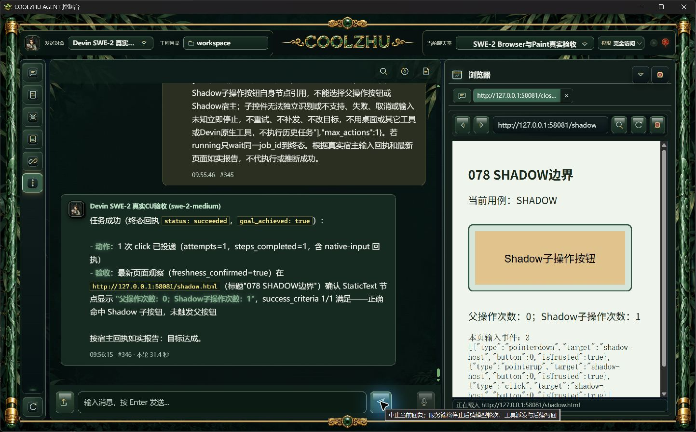
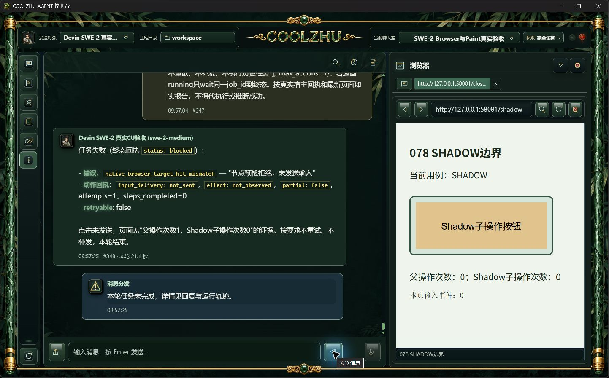

# 0.2.80 会话库并发打开修补与测试交接

## 问题与实现

PR84的683源码push检查成功，但同份源码PR检查在首次并发打开真实SQLite会话库时出现DatabaseBusy，1389通过、1失败、6忽略。原用例每轮6线程同时首次打开、共8轮，不是模型回复夹具。原远端失败、旧实现本地成功及修补后结果均保存，不能用重跑掩盖失败。

现有WAL模式切换已有显式BUSY处理，但前置只读PRAGMA user_version可能直接BUSY。[SQLite官方busy handler说明](https://www.sqlite.org/c3ref/busy_handler.html)表明注册等待器并不保证每次锁冲突都调用；[WAL说明](https://www.sqlite.org/wal.html)也保留BUSY情形。computer_use_store只对这一条无副作用读取重试，沿用5秒总期限，恢复原5秒busy timeout；事务内直接读取，不重放业务事务或迁移。错误保留SQLite主码、扩展码并补失败阶段。版本超前拒绝、备份和迁移行为保持。

原日志没有确切失败阶段，旧实现本地同一用例成功，因此本轮是按官方锁语义补齐真实缺口，不能宣称精确重现原CI那一次根因。后续阶段诊断用于实际定位，未消除的失败须继续处理，不能放宽期限、删除用例或静默吞错。

## 已完成验证

离线cargo build通过；既有Web完整回归1390通过、0失败、6忽略，83.59秒。既有并发首次打开用例另有限重复10次，每次8轮×6线程，均通过。只读原始日志及字节SHA见[CI证据](ci-lock-fix/manifest.json)。这些代码检查不替代用户要求的真实SWE软件截图验收。

## 正常安装与正式实操

0.2.80正常发布链六门通过，Windows安装退出0，Program Files全部1150文件逐一长度/SHA匹配。源码cc6c43183acd6340f42230dab0f86d22fce6ee8c，源码快照21e25318cfefda33742ce078eb1c53ad7771eab44de93f9e2564193f990ed784；MSI 276335234字节，SHA256=bf55afaf1ae16afa6a195099b5faa2843e718b7d740c437bc3524bf443a76fae。原生产者报告pkg-report-release-20261006-095230481-7cf26132和完整清单保留，不自行改写构建身份。

默认8765、真实Program Files后台与桌面壳、原SWE-2-medium / veiled-anise完成两轮：

| 用例 | 消息／耗时 | 原始结果与验收 |
| --- | --- | --- |
| 明确选择Shadow子button自身 | #345/#346，31.4秒 | succeeded、goal=true、attempts1、steps1，sent/released；网页父0子1，三种pointer事件trusted、独立shadow-click=1，正例通过 |
| 被独立Shadow子控件覆盖的父button | #347/#348，21.1秒 | blocked / native_browser_target_hit_mismatch，attempts1、steps0，not_sent/not_needed；当轮网页输入0、父子0，预期拒绝通过 |

每段ACP均terminal/end_turn/process_drained=1，同一原远端绑定保持，未执行历史失败请求。[原图、请求、真实事件与正式安装摘要](installed-shadow/manifest.json)。父目标失败是预期拒绝通过，不能写成模型目标达成。页面标题“078 SHADOW边界”是保留的原HTML模板名，不是安装产品版本；产品身份以逐文件安装核验为准。0.2.79历史候选/正式与关闭尝试在[079报告](../release-0.2.79/change-report-and-test-handoff.md)继续独立保存。

cc6源码两条远端Web console baseline检查均success：[PR运行](https://github.com/coolzhulike/coolzhuagent/actions/runs/37401076973)、[push运行](https://github.com/coolzhulike/coolzhuagent/actions/runs/37401073440)。原锁失败仍在CI证据中，后续纯文档HEAD需另核，不用此前成功冒充新提交结果。

完成后按PID、完整EXE路径、UTC启动时间核对再停止自有验收后台/桌面壳及HTML服务器；正常桌面启动入口重新启动原日常工程C:/Users/zhupu/coolzhuagent，源码cc6、Program Files进程与原输入安全库自检通过。保留用户日常Qwen选择和历史消息，未向其发送新模型请求；本轮实操全部使用SWE。历史unknown原样保留。[正常启动与恢复原图](startup-recovery/manifest.json)。

## GitHub 交付

[0.2.80 预发布安装包](https://github.com/coolzhulike/coolzhuagent/releases/tag/v0.2.80)已公开，tag实际指向上述cc6源码。四个资产均为uploaded，GitHub返回的长度与SHA256逐一匹配本地文件，见[发布核验](evidence/github-release-verification.json)。本地安装包同时交付到C:/Users/zhupu/Desktop/coolzhuagent/dist/CoolzhuAgent-0.2.80.msi；当前正常桌面入口已安装并运行本版本。当前[PR84](https://github.com/coolzhulike/coolzhuagent/pull/84)供合入审查，尚未合并。

## 下一步与验收边界

四项任务总体未完成，iframe内部自动化、严格跨URL新文档down/up和输入前/按住关闭替换面板继续见[当前队列](../../analysis/2026-09-21-integration-review/current-acceptance-queue.md)。验证期间关闭撤销旧证明已在079通过，不能替代输入前/按住竞争。iframe方案按代码与WebView2官方接口完成职责审查，见[子文档绑定实施方案](../../analysis/2026-09-21-integration-review/native-browser-iframe-next-plan.md)，当前尚未实施，不计通过。

后续测试执行者应使用同一SWE远端，对独立子文档点击、父/其它Frame误击拒绝、Frame单独导航后旧引用失效分别实操并截图；同来源与跨进程Frame分开验，渲染不能替代输入。无需新增大量镜像单元用例。插件配置/取消/超时、多屏、Goal/Relay附件、升级安装全集、启动其它模式与总体审查仍开放。Paint按缩减范围基础输入已正式通过，微信不改不测，Opus暂停；不用子Agent、Qwen或模型回复夹具。
