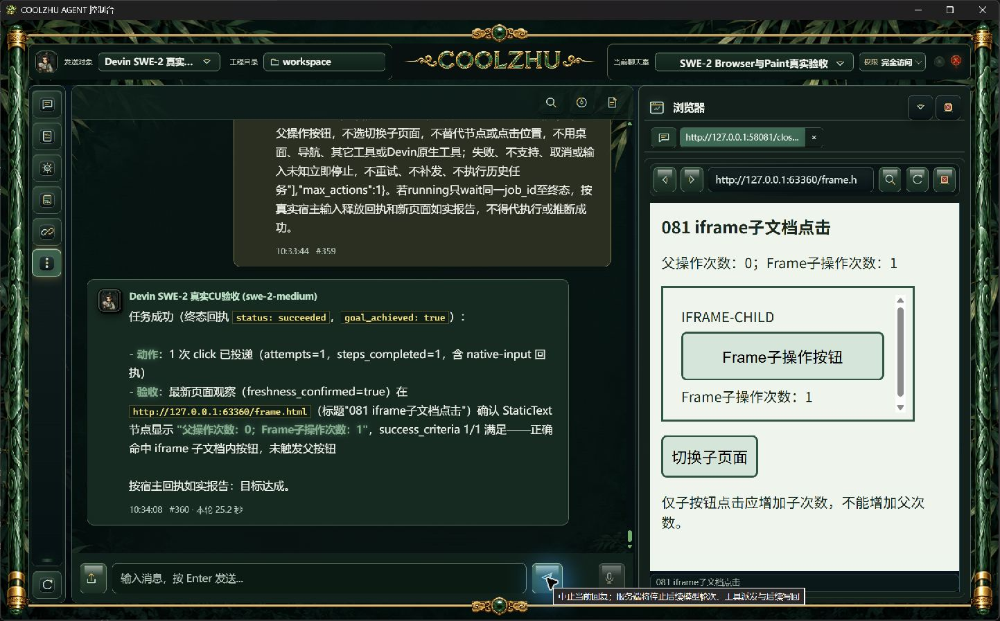
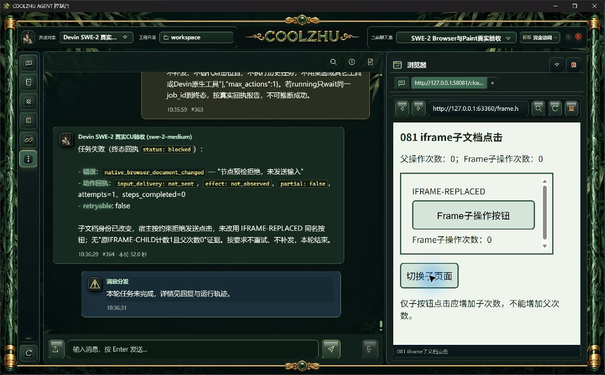

# 0.2.81 同进程iframe点击与测试交接

## 问题与职责

0.2.80的内置浏览器可以渲染iframe，但只给顶层Frame和开放Shadow中的控件提供操作引用，无法直接点击子文档控件。本轮增加宿主读取的Frame/独立文档根/owner链绑定；模型仍只使用不透明节点引用。文档识别在native_browser_document，缓存绑定在nodes，采样在observation，预检在target，原生输入与释放继续由input负责；不新增权限系统，不将子文档混入普通父节点子树。

初期支持同进程子Frame中的button/link/checkbox/radio click；子编辑、键盘、滚动和导航另行验收。独立进程Frame没有本session的contentDocument时只显示可读范围和truncated事实，不伪造可执行引用；WebView2多Target/session另实施。顶层/子文档导航改变Frame loader、DOM根或owner链时，原观察与引用失效；命中父iframe、其它子Frame或独立子控件不能代替原目标。点击按下后的释放规则及既有2秒执行票据不变。

## 候选结果

Web/桌面壳离线build通过；桌面壳70项代码回归通过，没有新增模型回复夹具。全部实际任务由原SWE-2-medium / veiled-anise执行，消息及回复保留原聊天室。候选证据29份文件包含三种通过、一次错误路线失败和一次未命中输入前窗口的尝试，全部原样归档。

| 场景 | 实际结果 | 验收含义 |
| --- | --- | --- |
| 子文档按钮一次点击 | #349/#350，36.9秒，父0子1，sent/released，3个trusted输入事件 | 候选正例通过 |
| 被Frame覆盖的父控件 | #351/#352，31.1秒，hit_mismatch，steps0、not_sent，网页0输入 | 候选预期拒绝通过，模型目标未达成 |
| 首轮子导航 | #353/#354，11.2秒，extension_unavailable、attempts0 | 测试漏写右栏原生浏览器，走外部扩展路线；不计通过，不删除原失败 |
| 点击后切换子页面 | #355/#356，37.3秒，steps1，verification/observation_stale | 仅验证期间撤销通过，不计输入前竞争 |
| 规划期间切换子页面 | #357/#358，35.3秒，document_changed、steps0、not_sent，父子0 | 候选旧子引用输入前拒绝通过 |

[原图、原请求、真实事件、过程与回执](candidate-iframe/manifest.json)。时间先后来自独立网页事件与实际规划诊断；切换由正常UI按钮执行，未添加宿主延迟，不将模型声称成功当作验收。

## 正常构建、安装与正式实操

0.2.81正常发布链六门通过，Windows安装退出0，Program Files全部1150文件逐一长度/SHA匹配。产品源码d9ca3e2d56c43647aa90875b2e895b86507b0989；源码快照2c593a60b4ae8d8349da5dfdcb34f278d28ce7f179a5e9fb30f946f874aaeb82。MSI 276327042字节，SHA256=57a19a3aeb489c3e9227dbf37d0df6008707e777b19f82547d00870e21156b63。生产者原报告pkg-report-release-20261006-103113128-af0528c7和1150文件清单按原字节保存，未改写已冻结构建身份。

默认8765、同一Program Files后台与桌面壳、原SWE-2-medium / veiled-anise正式三轮：

| 场景 | 聊天消息／整轮耗时 | 宿主、网页事实与验收 |
| --- | --- | --- |
| Frame子button一次点击 | #359/#360，25.2秒 | succeeded、goal=true、attempts1、steps1；sent/released，三个trusted输入事件，父0子1，正例通过 |
| 被Frame覆盖的父控件 | #361/#362，34.0秒 | blocked / native_browser_target_hit_mismatch、steps0、not_sent/not_needed；当轮网页零输入、父子0，预期拒绝通过 |
| 规划期间仅子Frame导航 | #363/#364，32.0秒 | blocked / native_browser_document_changed、steps0、not_sent/not_needed；新同名按钮未被点击、父子0，旧引用输入前拒绝通过 |

第三轮正常UI“切换子页面”发生在真实规划开始与结束之间：1791254176783 < 网页导航事件 < 1791254183770，未给宿主添加延迟。原请求、切换截图、网页真实事件、完整过程、正式安装与源码身份见[21份正式证据](installed-iframe/manifest.json)。后两项是预期拒绝，模型目标未达成，父运行真实状态为failed，不能写成模型绘制或点击成功。每段ACP均terminal/end_turn/process_drained=1，继续原远端上下文，未复活历史失败请求。

产品源码两条远端Web console baseline均success：[PR运行](https://github.com/coolzhulike/coolzhuagent/actions/runs/37404157686)、[push运行](https://github.com/coolzhulike/coolzhuagent/actions/runs/37404154807)，[原始服务端记录](evidence/remote-checks/manifest.json)。后续纯证据文档HEAD检查另核。

## 交付与正常入口恢复

[0.2.81预发布](https://github.com/coolzhulike/coolzhuagent/releases/tag/v0.2.81)已公开，实际tag绑定d9产品源码；MSI、摘要、安装报告和包扫描四资产的服务端长度/SHA匹配，见[发布核验](evidence/github-release-verification.json)。安装包也已同步Desktop项目dist。

逐一核对PID、完整路径、UTC启动时间与文件摘要后结束自有验收后台/壳及临时HTML服务器，正常桌面入口恢复原日常工程C:/Users/zhupu/coolzhuagent。Program Files进程、d9源码、原输入安全库与新自检通过；实际启动原图见[恢复证据](startup-recovery/manifest.json)。保留用户日常Qwen选择和历史消息，没有向其发送新请求；全部本轮模型实操仍为原SWE。资源状态safe，两个历史outcome_unknown原样保留，不改安全库、权限或历史终态。

## 后续验收边界

本轮未修改正式前端显示，不添加调试信息、配置开关或多余文字。微信不动，Paint基础能力按缩减要求已有正式通过。跨进程iframe、子编辑/键盘/滚动、严格跨URL按住导航、输入前或按住关闭替换面板、多屏、插件配置/取消/超时/许可竞态、Goal/Relay附件、完整自动升级、启动其它模式及四项总体审查仍见[队列](../../analysis/2026-09-21-integration-review/current-acceptance-queue.md)。仅主会话实施与测试，Opus暂不调用。

下个执行者根据每项未完成边界选择实操，不把同进程click推定为全部iframe或Browser Use通过。网页是独立实际HTML测试场景，服务器记录浏览器真实trusted事件；没有模型回复夹具。首次路由失败及晚于点击释放的候选记录继续保留，不能删去失败或追认未命中时序。
