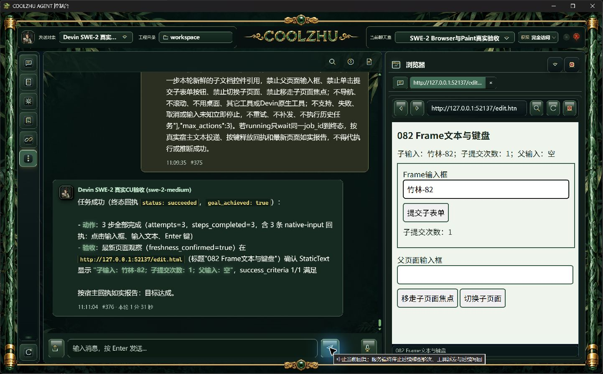
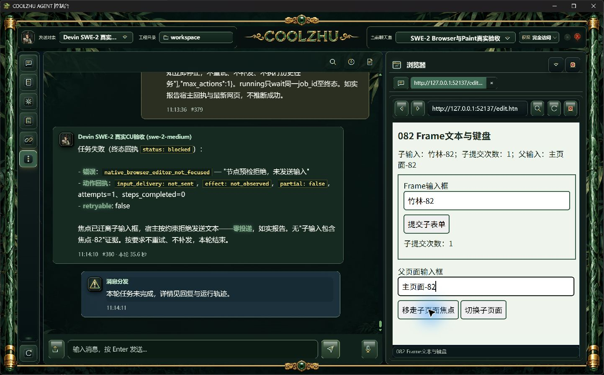

# 0.2.82 同源Frame编辑、回车与测试交接

## 问题、变化与模块职责

0.2.81已支持同进程子Frame点击，但子编辑/键盘被显式限制为顶层。新增子textbox/searchbox/combobox引用和唯一焦点引用；编辑、页面单键复用已有DocumentScope及Frame/loader/DOM根/owner链身份、目标命中、输入许可和释放台账。不建立第二套权限或Frame执行器，不增加正式UI调试配置。

真实深层表单暴露DOM采样漏控件：固定深度8改16，缺失后代报告truncated，保留节点/响应预算。文档完整性由dom负责；可见控件采样由observation负责；只读焦点和编辑状态由editor/key负责；最终输入仍由原原生执行模块负责。

仅凭子document.activeElement可能把迁走的焦点误认成可输入。固定只读函数增加浏览器内建Document.hasFocus()，最终派发回调再次检查。初版跨Window遍历被throwOnSideEffect拒绝；保留这项保护并改用浏览器的原生焦点判断，未自动聚焦、未写DOM。

真实回车曾收到down/up却没有提交表单。Enter改为Input.dispatchKeyEvent keyDown携带回车字符，其它页面单键沿用原rawKeyDown；仍一次按下和一次释放，继续记录投递/释放结果，不点击提交按钮代验。

另修远端ACP分类测试的3秒共享预算：连接与分类任务分别给30秒，并在连接成功后重建任务期限。只改变该既有测试的预算；生产期限、取消与权限规则未改。原CI失败日志保留，不能用其它HEAD成功替代本次检查。

## 候选真实SWE实操

全部使用原SWE-2-medium / veiled-anise，同一聊天室；不用Opus、Qwen、子Agent或模型回复夹具。网页为真实HTML表单，事件由实际浏览器记录。

| 场景 | 消息与耗时 | 事实与含义 |
| --- | --- | --- |
| 深层控件首轮 | #365/#366，39.8秒 | target_not_found，零输入；Agent采样缺口，已修补 |
| 初版焦点检查 | #367/#368，1分1秒 | click释放后editor_unavailable，text未投递，失败保留 |
| 请求漏写原生路线 | #369/#370，21.1秒 | extension_unavailable，零输入；不计能力通过 |
| 只读异常诊断 | #371/#372，1分2秒 | focus_read_side_effect，text未投递；保留副作用保护后调整固定读函数 |
| 原rawKeyDown回车 | #373/#374，1分36秒 | 子文字已写入，down/up已释放，提交0；budget_exhausted，完整流程失败 |
| 最终子编辑与回车 | #375/#376，1分31秒 | 三步succeeded、goal=true；trusted输入竹林-82、Enter、submit一次、keyup；父空 |
| 主页面编辑 | #377/#378，1分11秒 | 两步succeeded；父主页面-82，子文字/提交次数不变 |
| 规划期间父焦点迁走 | #379/#380，35.6秒 | editor_not_focused，steps0/not_sent；父子文本均未被模型更改 |
| 规划期间仅子导航 | #381/#382，28.2秒 | document_changed，steps0/not_sent；新同名子控件未收到模型文字 |

焦点切换实际发生于1791256432401至1791256445691的规划期间；子导航实际发生于1791256496471至1791256506636的规划期间。普通UI用于准备焦点和触发变化，这些click/focus事件不能写成模型输入；模型文本/键盘事件为零。两个预期拒绝的父运行真实状态是failed，不计模型目标达成；未添加宿主延迟或补发旧请求。

[53份原始候选证据与清单](candidate-frame-edit/manifest.json)保留九轮实操、源码快照、各次程序身份、原截图及事件。EDIT3无独立after图、EDIT4无独立before图，未补造历史截图。子导航后父页面的状态文字仍是旧postMessage缓存；实际新子控件为空、提交0，以独立子页面ready及零输入事件核验，不能把父缓存当新文档状态。

桌面壳offline build、70项既有回归通过；Web完整1390通过、6忽略。未新增镜像实现的单测堆积。正常0.2.82构建、安装与正式四项复测待完成；候选截图不能代替安装版验收。

## 后续测试边界

只验同源同进程子Frame编辑与页面单键。跨来源/独立进程Frame、子滚动、严格按住跨URL导航或面板关闭/替换、多屏、插件配置/取消/超时/许可竞态、Goal/Relay附件、完整升级、启动其它模式和四项总体复核仍见[当前队列](../../analysis/2026-09-21-integration-review/current-acceptance-queue.md)。不把此阶段推定为全部Browser Use完成。微信不改不测，Paint按缩减范围基础已有正式通过。

后续执行者使用正常安装版，在原SWE会话依次复测子click/text/Enter、顶层编辑、规划期间父焦点迁走和仅子文档导航；独立网页事件、宿主投递与释放回执、真实时序和截图一起判断结果。节点/身份/输入模块边界保持清晰，失败不重试原任务。
