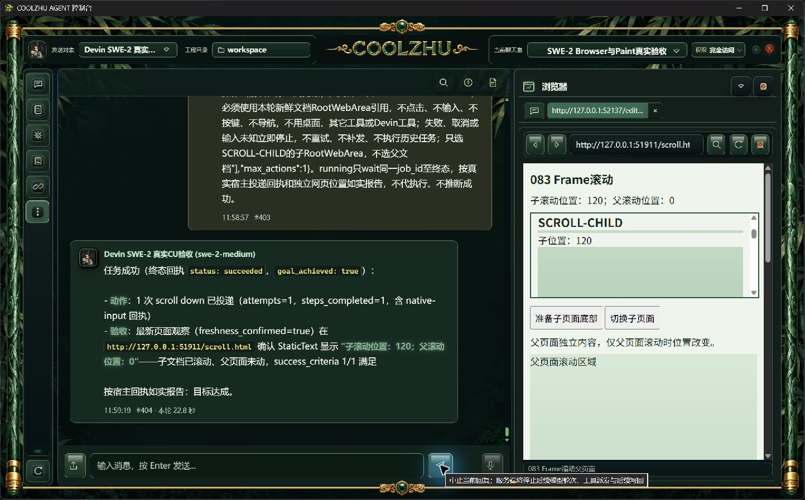
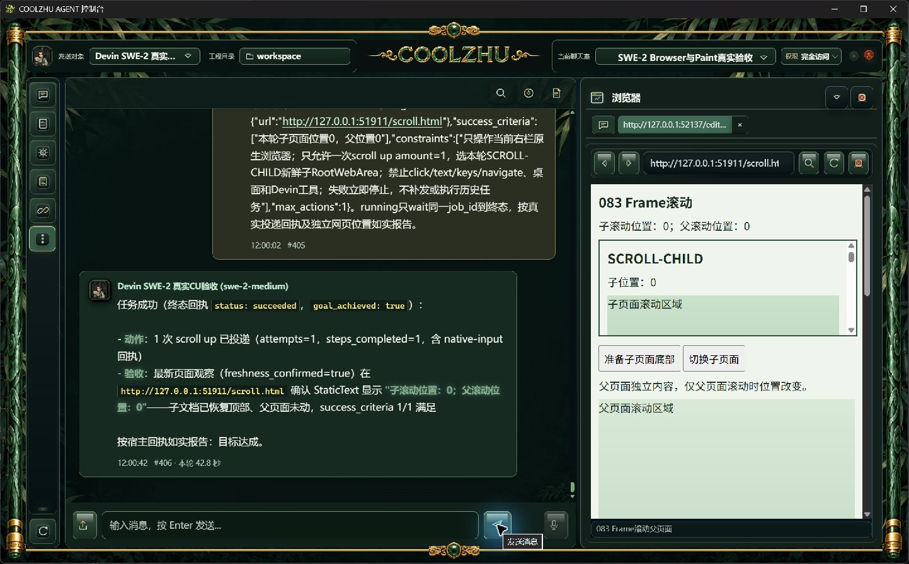
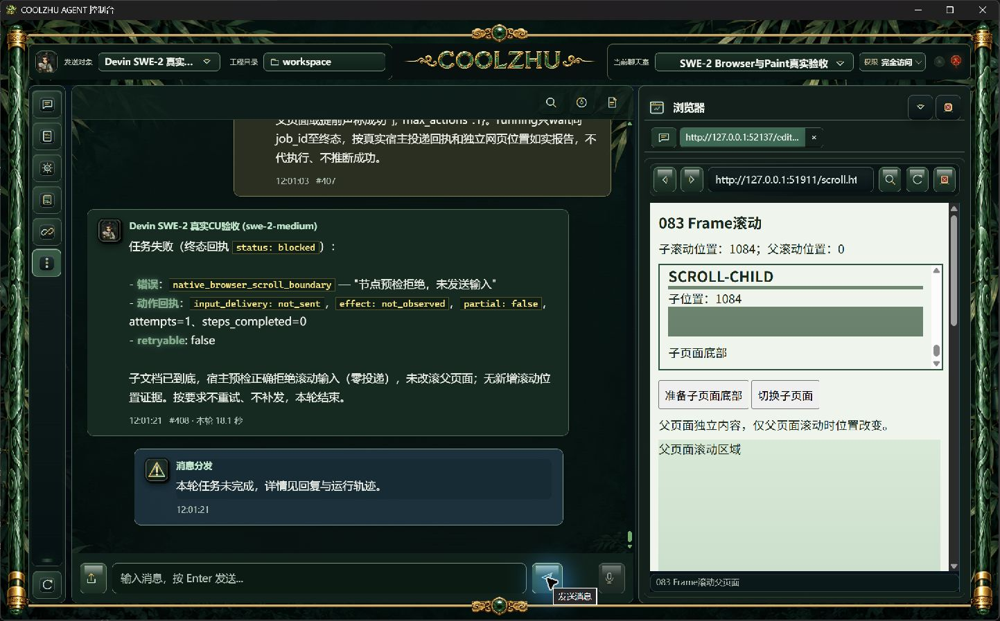
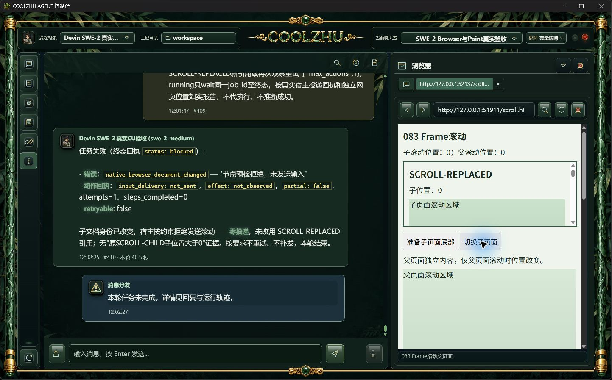
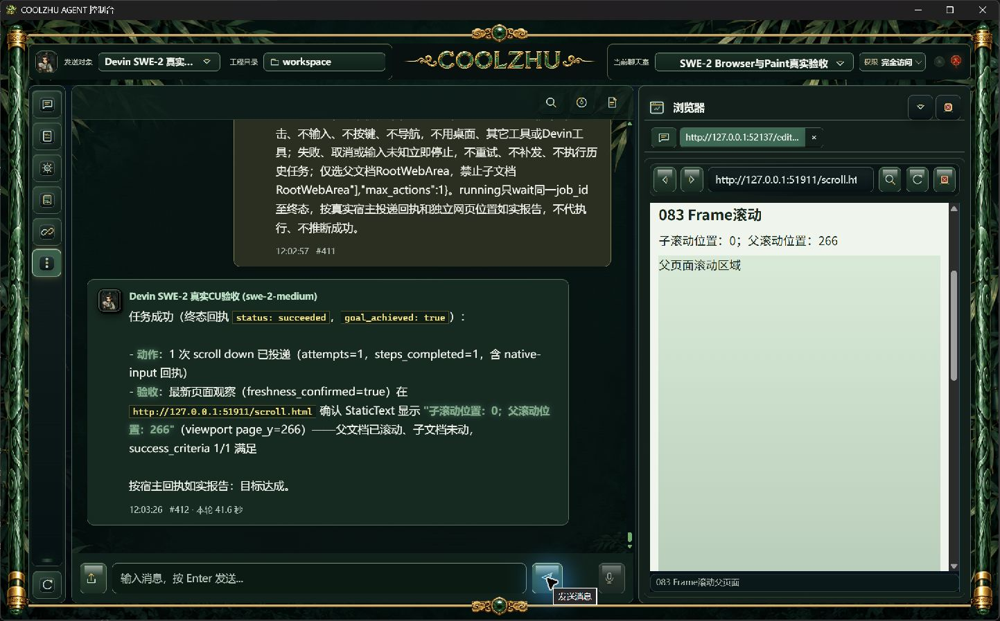

# 0.2.83 子文档滚动改动报告与测试交接

## 问题和模块职责

0.2.82子页面点击、文字和Enter已经通过，但观察不提供子RootWebArea，滚动预检仅允许顶层，并用父视口计算距离。本版补同源同进程子文档上下滚动；复用原DocumentScope、文档链、输入许可和wheel台账。

观察模块提供子文档Root引用；独立native_browser_scroll模块负责只读滚动根状态、iframe owner几何、命中Frame和剩余距离；输入模块只沿原wheel路径发送事件。宿主固定函数使用throwOnSideEffect，不改DOM、不直接设置scrollTop、不自动聚焦，不接受模型脚本。准备和执行复核文档/滚动状态；到边缘零投递，单次距离不超过子余量。导航仍限顶层。

## 正式安装与来源

正常release脚本、六项发布门和Windows正常安装通过；Program Files全部1150文件长度/SHA一致。MSI 276351618字节，SHA256 `ded3b979a181269c321b4efa7a26852f6b993b4c15682cd13aa94d42d73dcebb`；冻结产品提交 `0b6c1c714c1302929bfcccc63f5b9123535e31cb`，快照 `036ab85c43402dd79b6d239c3fa4b5491b9f8898819011a83454928dc2066ebb`。生产者原始记录在[evidence/build-identity](evidence/build-identity)。候选4项原始证据46份、当时未提交源码快照及独立EXE身份见[候选清单](candidate-frame-scroll/manifest.json)；不追认为参考HEAD的已提交产品。

## 原SWE-2正式实操

默认8765、Program Files配套程序、原SWE-2-medium / veiled-anise及原聊天室。五项均独立新请求，没有模型回复夹具、失败补发或人工代替模型滚动。每轮内外ACP end_turn且process_drained=1；实际投递关联本轮桌面壳PID。只读网页事件、位置与截图独立于模型报告。

| 场景 | 验收事实 |
| --- | --- |
| 子向下 | 一次trusted正向wheel，子0→120，父0 |
| 子向上 | 一次trusted负向wheel，子120→0，父0 |
| 子到底 | native_browser_scroll_boundary，not_sent，完成动作0，父0 |
| 规划期间子导航 | 导航事件严格在planning开始/完成之间；native_browser_document_changed，not_sent，新子位置0 |
| 父单独滚动 | 一次trusted正向wheel，父0→266，子0 |

边缘与导航两项的父运行确为failed、模型goal_achieved=false；验收通过指正确拒绝并零投递，不是模型目标成功。普通UI的到底准备和子页面切换独立记录，不能当成模型动作。原始请求、结果、进程身份和网页事件见[正式五项清单](installed-frame-scroll/manifest.json)。

## 回归、恢复与后续测试设计

候选离线构建、既有70项桌面壳与1390项Web回归通过（6忽略）；正常发布链再次离线编译实际产品。原安全库资源safe/accepts_new_input=1，历史2个outcome_unknown、9个closed块保留，不通过删库或重置恢复。测试进程与网页服务按PID、完整路径、UTC启动时间和摘要核对后结束；正常桌面入口恢复C:/Users/zhupu/coolzhuagent及原安全库，见[启动恢复清单](startup-recovery/manifest.json)。

后续执行者可用同源真实iframe页先向下再向上，核实际scrollY变化、父位置、可信wheel事件和原生回执；到边缘请求应明确拒绝。导航负例必须保留planning开始/完成时间与导航事件，未命中时序保留诊断，不增加宿主等待或重试。ACK不能替代效果，截图不能替代程序来源核验。

本阶段不外推跨来源/OOP、横向/RTL、嵌套容器、中心被裁剪/遮挡或变换、严格按住跨URL/面板变化、多个显示器及其它队列。截图中保留的预览标签仍显示旧URL，当前地址栏和宿主真实URL一致；标签状态同步需单独复核，不算全部浏览器UI已闭环。Paint按用户缩减范围基础已正式通过，微信不动，Opus暂停，不用子Agent。总队列见[当前验收队列](../../analysis/2026-09-21-integration-review/current-acceptance-queue.md)。

## 产品来源远端检查和逐轮耗时

冻结产品来源0b的push/PR两路Web console baseline均已完成success，原始API响应见[evidence/remote-checks/source-0b](evidence/remote-checks/source-0b/manifest.json)。不将来源检查外推为后续文档HEAD的结果。正式五轮耗时依次为22.8、42.8、18.1、40.5、41.6秒。既有工程回归可包含隔离夹具；本版五项模型实操均为原SWE真实会话。正常日常入口恢复截图可能显示用户原Qwen历史聊天室，恢复仅做启动核验，没有切换实操模型或发送Qwen请求。

## GitHub分发

[0.2.83预发布](https://github.com/coolzhulike/coolzhuagent/releases/tag/v0.2.83)已公开，四个分发资产服务端长度/SHA与本地一致，实际标签绑定0b冻结来源；见[evidence/github-release-verification.json](evidence/github-release-verification.json)。用户桌面dist保留相同安装包和摘要文件。PR84继续承接后续工作，未自动合并。
