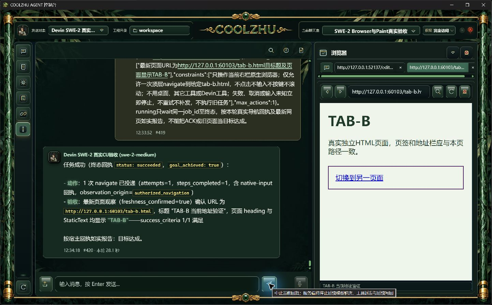
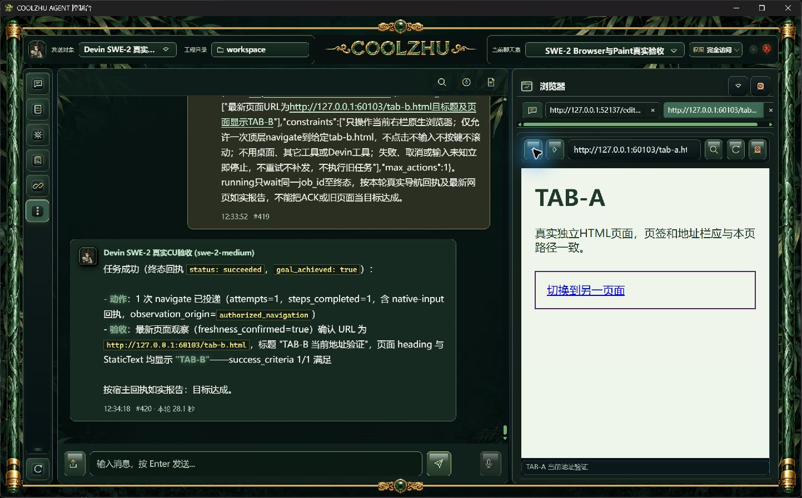
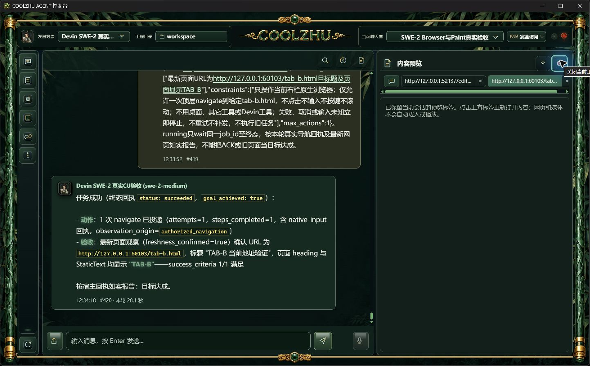
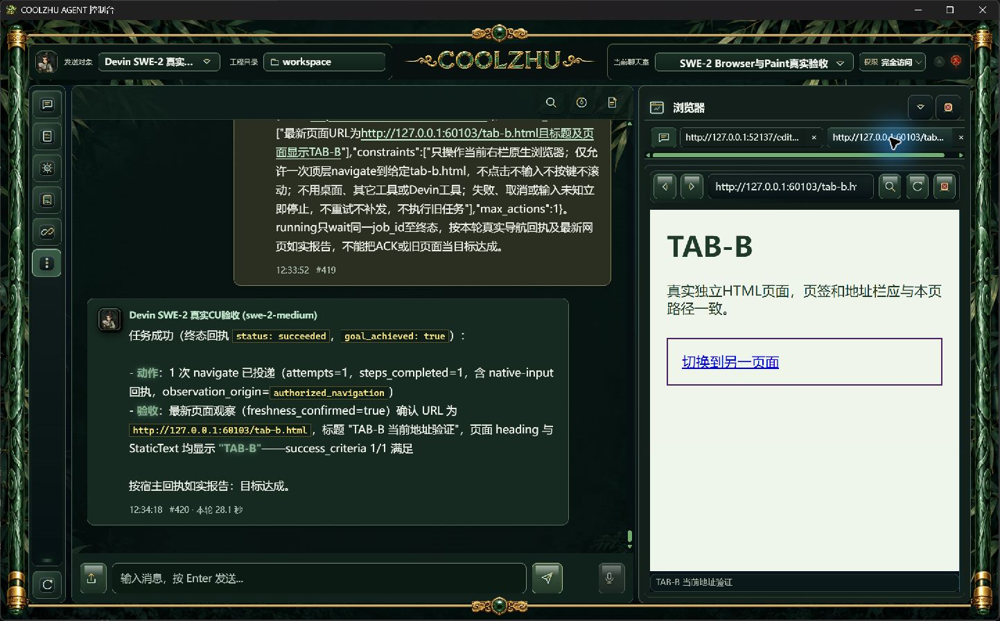

# 0.2.84 浏览器导航与预览标签改动报告及测试交接

## 问题、行为与职责

原生网页已导航时，地址栏和宿主实际URL改变，预览标签仍显示最初链接。WorkspacePanels在接纳当前网页的导航状态时同步label、locator、标签ID及持久化状态；原消息来源索引仍保留。不增加后端接口、工具、任意网页脚本、执行器或权限入口。

真实SWE候选首轮暴露另一问题：合法显式Browser请求要求“导航到B”，约束禁止点击、文字、按键和滚动，旧本轮范围判断误降为只读。ComputerUseTurnScope仅依据当前用户合法computer_use_perform对象的明确导航目标保留导航；绝对零输入或禁止导航仍优先。JSON原约束字符串直接参与禁令识别，避免结束引号干扰。历史任务、模型输出不能扩大本轮权限。

## 正常包、安装与源码

冻结产品提交 `82f769611a9b35cc947e8615575868e5cc34d8b9`，快照 `b2aa2200dbdc48e4852de32bcaa7e724dd752fa7e9e357e67064d3afc434b9ea`。正常release链六项发布门通过，生产者原始四份报告在[evidence/build-identity](evidence/build-identity)。MSI 276339330字节，SHA256 `224478dbae9d1bc0ff2b6f82ec2352c6fe35220f1ac3fa54a50e99e370fdac21`。正常Windows安装exit 0；Program Files全部1150文件长度/SHA一致，CLI显示0.2.84和同一冻结提交。出包后仅补文档、证据，不改变产品来源。

## 原SWE-2正式实操与普通UI回归

从Program Files配套进程、默认8765、原聊天室和SWE-2-medium / veiled-anise持续上下文发送独立新请求。用户消息419、回复420，28.1秒。仅一次navigate从真实A页到B页，attempts=steps_completed=1；实际壳PID31996绑定回执acknowledged_no_held_input，独立HTTP GET严格在该动作开始/完成之间。新观察URL、标题和页面TAB-B确认效果。内外三条ACP均end_turn且process_drained=1。原请求、完整模型/宿主事实、进程身份、网页日志及截图见[正式清单](installed-tab-sync/manifest.json)。未使用模型回复夹具、失败补发或人工代替本轮导航。

| 检查 | 实际结果 |
| --- | --- |
| 模型A→B | 实际一次导航，B页面、地址栏与当前标签一致 |
| 普通后退 | A页面、地址栏与当前标签一致 |
| 普通前进 | B页面、地址栏与当前标签一致 |
| 关闭右栏后重开标签列表 | 保留B标签，网页未自动载入 |
| 显式点击保留的B标签 | 重新载入B，页面、地址栏与标签一致 |

四项普通UI操作发生在模型终态之后，与模型动作独立记录。起点A通过地址栏普通操作准备。一次尝试点击聊天中长行A链接时，Windows辅助索引点到了消息引用选择，已经清除并保留诊断截图；代码已有交互元素排除，未将这次索引命中误差计为模型导航或确证产品缺陷。另一历史保留标签未主动加载，旧显示不追改；当前活动网页更新后标签已正确同步。

## 失败诊断、回归与恢复

候选NAVIGATE首轮误判只读，attempts=0、页面仍A，未计通过；修补后的独立NAVIGATE2为38.8秒、一次实际导航成功。候选42份原始证据含源码补丁/摘要、进程身份、失败及成功事实，见[候选清单](candidate-tab-sync/manifest.json)。首轮禁令负例的JSON引号诊断也保留，修补后既有范围8项通过。完整Web主程序1390通过、6既有忽略，库8项和宿主绑定1项通过；没有新增镜像用例。[实际构建回归日志](evidence/build-and-regression/manifest.json)。既有工程回归可以包含隔离测试，本轮模型实操均为真实SWE。

原安全库资源safe、accepts_new_input=1，历史2个outcome_unknown及9个closed块保留；没有删库、重置或复活旧请求。自有测试配套进程和网页服务按PID、完整路径、UTC启动时间和摘要核对后结束。正常桌面入口已恢复原工程C:/Users/zhupu/coolzhuagent、Program Files 0.2.84和原安全库，见[恢复清单](startup-recovery/manifest.json)。恢复截图显示日常原Qwen历史聊天室，仅核启动，没有发送Qwen请求或切换本轮实操模型。

冻结产品push/PR两路远端检查均success，[原始响应](evidence/remote-checks/source-82/manifest.json)。后续文档HEAD需另核，不外推旧检查。

## 后续测试设计与限制

测试执行者可用两个独立普通HTML页，从A发仅允许一次navigate的当前用户请求，核对HTTP事件时间、实际壳绑定和新页面三项；终态后再做后退、前进和关闭/重开。明确禁导航、绝对零输入仍应不投递，不能靠历史许可或模型自行改参数解除。

本版仅闭环顶层导航及标签同步。跨来源/跨进程iframe、横向/RTL及嵌套滚动、严格按住跨URL/面板变化、多屏、插件剩余生命周期、全自动升级、演出其它模式和四项总体复核仍开放。[当前验收队列](../../analysis/2026-09-21-integration-review/current-acceptance-queue.md)。下一步跨进程方案已按官方WebView2 ForSession接口补充到[文档](../../analysis/2026-09-21-integration-review/native-browser-iframe-next-plan.md)，尚未实现或计通过。Paint按用户缩减范围基础已正式通过；微信不动，Opus暂停，不用子Agent。

## GitHub分发

[0.2.84预发布](https://github.com/coolzhulike/coolzhuagent/releases/tag/v0.2.84)已公开，四个分发资产服务端长度/SHA与本地匹配，实际标签绑定82冻结产品来源。见[evidence/github-release-verification.json](evidence/github-release-verification.json)。桌面dist保留同包和摘要。PR84承接代码与证据，正常日常入口为084；整体队列继续开放。
