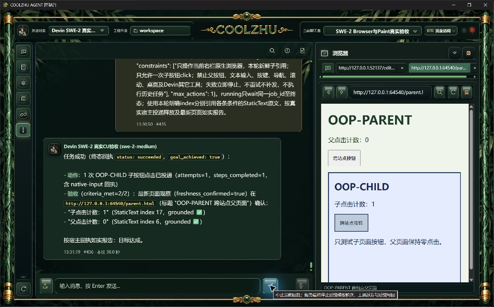
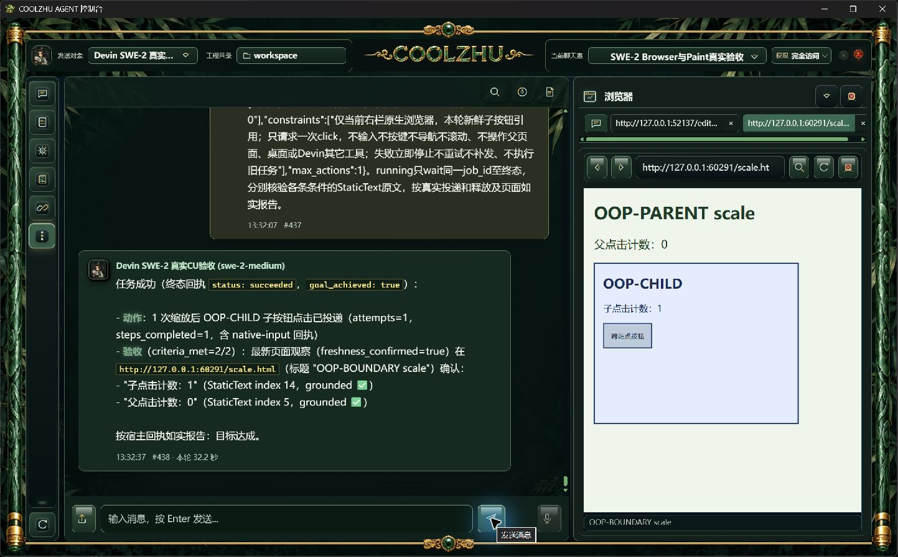
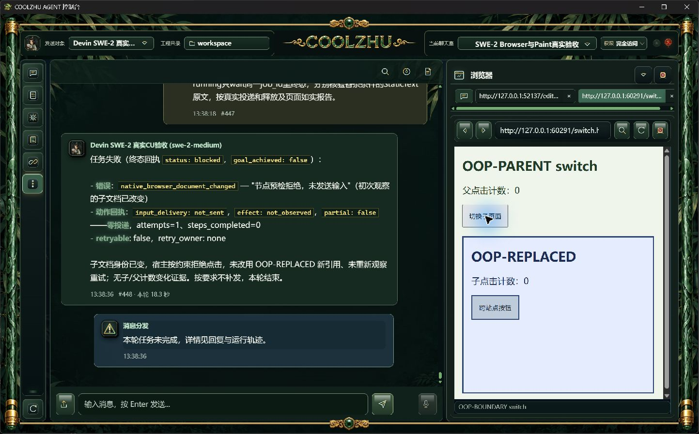

# 0.2.85 独立进程子文档点击改动与测试交接

## 问题及最终行为

0.2.84能够显示跨站点iframe，但顶层DevTools树不包含独立进程子文档，真实SWE请求找不到子按钮。新实现由宿主附着实际iframe target，按真实父Frame、owner及子文档身份读取子AX/DOM，在子视口定位后换算到顶层WebView执行原有输入流程。父子同名按钮和相同backend数字不会混为同一目标。

新增native_browser_sessions负责私有附着及缓存，native_browser_frame_geometry负责局部坐标、owner缩放和父命中；document负责身份及根定位，observation负责有界采样，target负责新鲜预检。devtools仅调用固定内部方法；模型、网页及HTTP请求不能传入CDP方法或session。原一次性许可、取消、输入释放、完整身份检查和2秒预检期限保留。

跨进程子Frame本阶段支持普通button/link点击、矩形及正向轴对齐缩放。旋转、斜切、透视、跨进程编辑/按键/滚动仍未支持，不能将同进程082/083结果外推。已有完整Browser验收队列继续开放。

模型验收输入新增本轮节点的明确index字段，减少数序号引用错误；原引文与索引匹配检查不变。单条复合条件引用跨Frame非相邻事实仍有表达限制，本轮独立检查父计数和子计数，旧失败没有追认为通过。

## 候选阶段真实事实

原SWE-2-medium、远端veiled-anise、原聊天室续接，全由主会话实操。未使用Qwen、Opus、子Agent或模型回复夹具。

| 用例 | 实际结果 | 验收判断 |
| --- | --- | --- |
| 084旧正式版跨站点子按钮，#421/#422 | 找不到目标，attempts0/steps0，父子0 | 旧版缺口复现，失败保留 |
| 首次候选配对，#423/#424 | 调试web与不同目录shell不满足实际同目录配对，host unavailable、零输入 | 测试环境错误，失败保留；改用正常配套路径，不放松身份核验 |
| 新独立子按钮，#425/#426 | 实际可信子点击1、父0、sent/released；复合引文non_adjacent_nodes | 操作成功但整轮未通过 |
| 新独立任务再点击，#427/#428 | 实际可信子点击2、父0、sent/released；模型引用标题索引导致text_mismatch | 整轮未通过；未修改既有引文检查 |
| 明确index后的缩放，#429/#430 | 56.5秒，单次子点击1/父0、sent/released，两条件grounded，会话completed | 候选通过 |
| 父覆盖层，#431/#432 | 34.8秒，hit_mismatch、not_sent、steps_completed0、无新子点击事件 | 候选负例通过，模型目标未达成 |
| 规划期间仅子导航，#433/#434 | 47.1秒，document_changed、not_sent、父子0，只有人工setup-switch事件 | 候选旧引用拒绝通过；不是按住期间导航 |

99份原字节材料、候选源文件/差异、完整实际台账及失败见[candidate-oop/manifest.json](candidate-oop/manifest.json)。诊断只读采样证明父子renderer分离、子LayoutViewport与顶层VisualViewport不同；临时远程诊断端口代码已移除，不进入候选最终构建及正式包。

## 正式安装版真实SWE验收

0.2.85正常Windows安装退出0，Program Files配套Web与桌面壳全部1150文件逐一长度/SHA256匹配。以下测试均使用该安装版、原SWE-2-medium及veiled-anise远端上下文，无临时诊断端口或模型回复夹具。每条新任务仅允许一次子按钮点击；终态确认、真实ACP进程排空和实际shell身份分别核对。

| 正式用例／消息 | 耗时 | 页面与宿主事实 | 判断 |
| --- | --- | --- | --- |
| CLICK，#435/#436 | 30.0秒 | 跨站点子按钮单次可信点击，子1/父0，sent/released，两条条件grounded | 正式通过 |
| SCALE，#437/#438 | 32.2秒 | 子Frame正向轴缩放0.8，可信子点击1/父0，sent/released，两条条件grounded | 正式通过 |
| COVER，#439/#440 | 28.9秒 | 父覆盖层仍在，hit_mismatch、not_sent、steps_completed0，无新增子/父点击 | 预期拒绝通过；模型目标未达成 |
| NAV4，#447/#448 | 18.3秒 | 真实规划区间1791265106284至1791265112565毫秒，普通页面按钮的可信切换发生于1791265110184.444；顶层URL保持，子变为OOP-REPLACED，父子0；document_changed、not_sent、steps_completed0 | 规划期间旧引用拒绝正式通过；不是按住期间导航 |

额外三轮全部保留：NAV #441/#442（26.4秒）未切换，正常子点击1/父0，不计导航负例；NAV2 #443/#444（34.9秒）切换晚于释放和页面验收，不计规划期负例；NAV3 #445/#446（19.7秒）切换发生在规划返回后约124毫秒、输入预检期间，document_changed零投递，仅证明该预检边界。没有重发失败请求；每轮为普通刷新后的独立新任务，没有添加延迟、改写模型结果或调整安全期限。

81份正式原始材料见[installed-oop/manifest.json](installed-oop/manifest.json)，包含四项主验收、三轮诊断、原消息及ACP/输入许可台账、可信网页事件、实际进程与安装身份。NAV4另存终态稳定页面截图，早期截图原字节不改。

## 代码回归、包来源与正常启动

离线实际build通过；桌面壳72通过，主控制台1390通过、6项既有忽略。首次主控制台完整回归与真实CU同时运行，启动恢复测试因共享windows-session-1命名输入锁Busy失败；停止已结束实操后，该项单独通过及完整1390通过。原锁、数据库和断言没有调整，首轮失败日志保留。

冻结产品源码ae87c7c83db3c661eca5a0b15eb6280ab37cad2a，生产者报告pkg-report-release-20261006-132631911-10d50575，源码快照288f88a0a21f596f9f0949de5f1c6599c8dc6a0387a5890398bf8be50d32e2f5。正常构建六项发布门全部pass，MSI为276396674字节，SHA256为b2226906133092b3fc82ba67667dcb98bd35ede0da16b6588e2052c42ae355b2。原始生产者报告在[evidence/build-identity](evidence/build-identity)。冻结产品push/PR两路远端检查均success；后续纯文档HEAD单独核验，不借用产品源码检查结果。

正式实操完成后，仅按PID、完整路径、精确创建时间和文件SHA停止本轮配套进程；两个自有网页服务另核完整命令及脚本SHA后结束。正常桌面启动入口已恢复0.2.85、原日常工程C:/Users/zhupu/coolzhuagent与原安全库；用户原日常Qwen选择保留，未发送新Qwen请求，全部本轮模型实操均为SWE。两个历史outcome_unknown许可和九个closed block保留，当前资源safe，未重置数据库。恢复、安装日志及CI原字节见[startup-recovery/manifest.json](startup-recovery/manifest.json)。

## 后续针对性验收

0.2.85已[公开预发布](https://github.com/coolzhulike/coolzhuagent/releases/tag/v0.2.85)，四项分发资产（MSI、安装报告、安全摘要、MSI.sha256）的服务端长度与SHA256逐项匹配；实际tag指向冻结产品ae87。不是更新下载/安装/重启全过程验收。公开记录见[evidence/github-release-verification.json](evidence/github-release-verification.json)。PR84继续待审查合入，冻结源码之后仅新增文档和证据。

已完成正式独立子按钮、缩放、父覆盖和规划期间子导航。其它模型可依据本报告及每个case的request、facts、before/after原图设计后续用例：父子同名按钮必须由子独立引用命中；分别核验父计数和子计数，不能用一条跨Frame非相邻引文或ACK代替输入/页面双证据。正例需可信事件位于实际step时间内且sent/released；负例需not_sent、无目标事件，并明确变化是在规划、预检、按下还是释放后。一个拒绝step记录不代表已经完成输入。

仍需继续：独立进程编辑/键盘/滚动、同名兄弟Frame、复杂嵌套/裁剪/变换、严格按下中跨URL导航及面板关闭替换。Paint基础输入按用户调整后的标准已通过；真实多屏环境及其它总体队列未补齐。自动升级完整安装重启、插件配置/取消/超时、Goal/Relay附件和启动演出其它模式等仍见[当前队列](../../analysis/2026-09-21-integration-review/current-acceptance-queue.md)。微信不改不测，Opus暂停。
