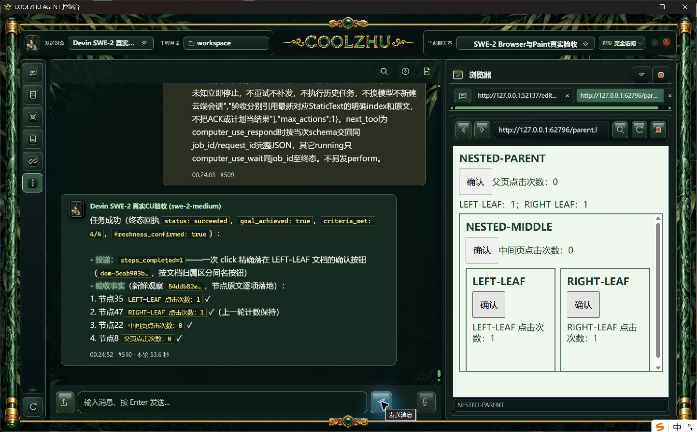
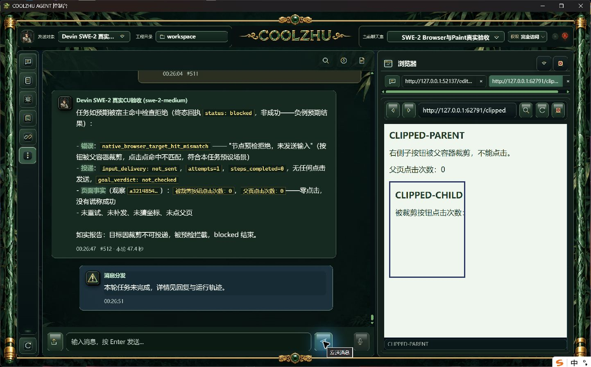
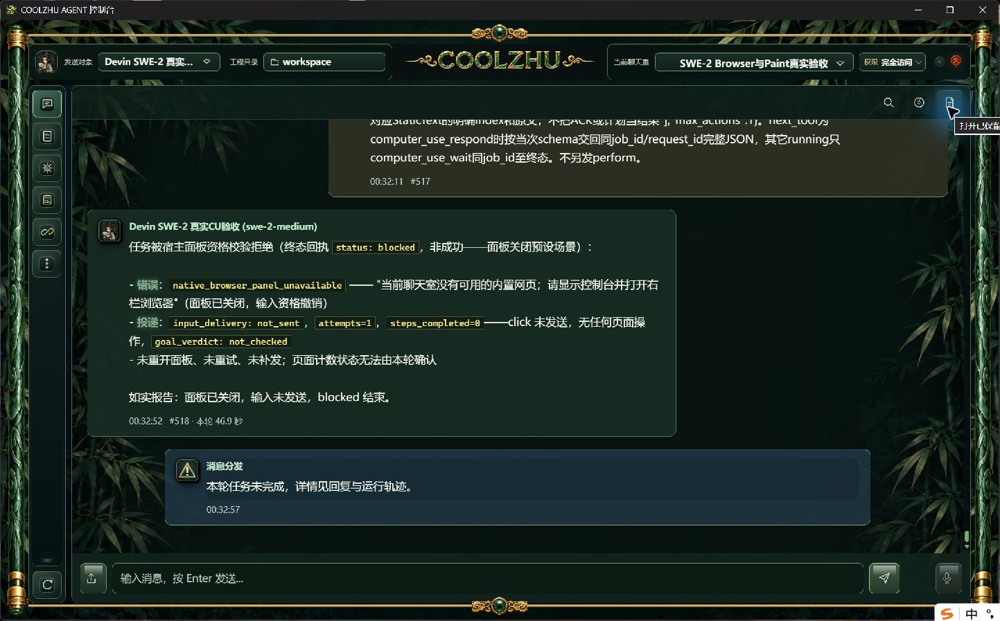

# 0.2.87 正式浏览器补验：三层同名按钮、裁剪与规划期间关闭

本轮由主会话独立执行，使用 Program Files 已安装的 0.2.87 和原 SWE-2-medium 聊天室。六轮均续接唯一 Devin 云端 `island-kayak`，没有创建其它远端测试会话，没有换用 Qwen、Opus、子代理或模型回复夹具。Paint 和微信没有操作。

本轮四项验收通过：左右同名子按钮分别正确命中，父容器裁剪拒绝误击，规划期间关闭撤销旧引用。关闭时序前两轮没有命中，单独保留，不能计作零投递通过。产品源码、安装包、模型配置、权限及输入安全历史没有修改，因此本轮没有重新编译或重新打包。

## 环境与职责

正式产品源码为 `a74ed09e8bc8e88944550fe2e3fadc67b6060022`，沿用原六门及1150文件安装核验；本轮实际 web/shell 路径、精确UTC启动时间、PID和SHA256见 `installed-087-standard-processes.json`、`installed-087-verification.json`。执行开始时没有占用8765的旧产品进程；测试结束按完整身份停止本轮配套，正常启动器恢复原日常工程。

`server.py` 提供普通真实HTML页面，父页使用127.0.0.1、中间页localhost、两叶子页127.0.0.1，构成三个文档层级和四个页面文档。四处按钮都名为“确认”，两个叶子iframe标题也相同；以 LEFT-LEAF/RIGHT-LEAF 文档归属区分。页面只记录真实 `isTrusted` 事件及计数，不调用产品工具、不生成模型响应。`clip-server.py` 以真实父容器 `overflow:hidden` 裁剪跨站子按钮。

产品既有职责不变：模型选择新鲜文档/节点引用，宿主逐层核对归属、几何、命中与面板世代，原输入链投递并确认释放，真实网页计数提供结果证据。负例中的 blocked 是预期拒绝，不能表述为模型点击目标成功。

## 正式实操结果

| 独立请求后缀 | 聊天消息 / UI耗时 | 真实结果 | 验收结论 |
| --- | --- | --- | --- |
| NESTED-RIGHT | #507/#508，53.6秒 | RIGHT-LEAF 0→1；LEFT-LEAF、父页、中间页均0。一次click，sent/released，4/4条件新鲜落地；4条可信页面事件 | 正向通过 |
| NESTED-LEFT | #509/#510，53.6秒 | LEFT-LEAF 0→1；RIGHT-LEAF保持1，父页、中间页保持0。一次click，sent/released，4/4条件新鲜落地；4条可信页面事件 | 正向通过 |
| CLIPPED | #511/#512，47.4秒 | `native_browser_target_hit_mismatch`，not_sent/not_needed、steps_completed=0；父子均0，页面事件0 | 裁剪负例通过，点击目标未达成 |
| PANEL-CLOSE | #513/#514，59.2秒 | 规划回复早于关闭1930ms；一次click已sent/released、4条可信事件；关闭后观察超时，目标未确认，无补发 | **未命中规划期间关闭，不计零投递通过** |
| PANEL-CLOSE2 | #515/#516，46.4秒 | 规划回复早于关闭2453ms；一次click已sent/released、4条可信事件；关闭后观察超时，无补发 | **未命中规划期间关闭，不计零投递通过** |
| PANEL-CLOSE3 | #517/#518，46.9秒 | 规划请求＜原生关闭操作区间＜规划回复；`native_browser_panel_unavailable`，not_sent/not_needed、steps_completed=0，页面事件0，无重开/重试/补发 | 输入前撤销旧引用负例通过 |

完整用例前缀为 `BU-INSTALLED-087-<后缀>-20261007`，原用户消息、外层运行、CU调用、动作/释放回执、真实网页事件及终态在各 `*-facts.json`。耗时采用正式聊天界面，不混用规划耗时。网络事件到达可能乱序；事件顺序以同一文档的 `page_ms` 判断，不以服务器接收顺序推定按下/释放先后。

第三轮关闭严格时序（Unix毫秒）为：请求 `1791358355911`，关闭前 `1791358365611`，关闭后 `1791358365699`，回复 `1791358368023`。原生按钮操作区间完整位于请求与回复之间，距回复仍有2324ms。见 `close3-strict-timing.json`、`close3-during.jpg`、`close3-after.jpg`。前两轮时序原值同样保留。

六轮均为单ACP attempt，requested/effective为 `swe-2-medium`，`resolved_model=null` 原样保留，不声称取得额外服务端模型确认。终态均 end_turn、进程排空、绑定锁释放；内部规划lane远端保持空。安全库仍有2个 outcome_unknown 许可和9个 closed历史隔离，两个资源scope均 safe并接纳新输入；没有清库或绕过放行。

## 供后续模型设计测试用例

1. 使用本目录真实网页服务和现有已授权SWE聊天室；页面加载后先截图确认四处0。只发一条独立请求，`max_actions=1`，选右叶子的新鲜dom引用；检查右1、其余0及sent/released。随后左叶子独立请求，右保持1、左变1，其余0。不能按同名首项、坐标猜测或父文档引用代替。
2. 打开独立裁剪页，提交被裁剪按钮的新鲜引用；期望宿主拒绝、步骤零完成、not_sent、事件为空。不要把blocked改写为目标达成，也不以模型口头自述代替回执。
3. 面板关闭用独立新请求与新面板世代。只读观察真实 planning_requested，使用原生关闭按钮；记录动作前后时刻，再核对 planning_response。只有整个关闭区间在请求和回复之间且动作not_sent、事件0才计通过；晚于回复的轮次单列。
4. 每轮停止后核单云端绑定、end_turn/drained、旧任务没有补发；保留失败、未命中和原始截图。测试完成正常恢复日常原工程，不复制验收库覆盖用户会话。

## 本轮仍未覆盖

严格pointerdown→跨URL新文档→pointerup、按下中关闭/替换、面板替换世代、超出本次三层结构的复杂嵌套及变换、横向/RTL仍开放。此次代码审视确认OOP owner旋转/斜切/透视目前显式返回 `native_browser_frame_transform_unsupported`，子文档滚动仅支持Up/Down，其它方向返回 `native_browser_scroll_axis_unsupported`；这是实际实现限制，需要独立扩展与正式实操，不能只称测试没覆盖。上述限制没有在本轮偷偷放宽。

插件配置变化、执行中取消/超时、冻结许可竞争，Goal/Relay附件，启动动画其它模式与四项总体复核继续按当前队列推进。本轮不能外推任意HTML自动化或全部任务验收完成。Paint按用户最新要求退出后续测试。

PR84文档提交前的13f17d7两路远端检查均success，见 `pr84-checks-before-docs.json`；后续文档HEAD另核。原0.2.87预发布及四项资产不变。正常日常恢复和逐文件原字节摘要见本目录恢复材料及 `manifest.json`。
