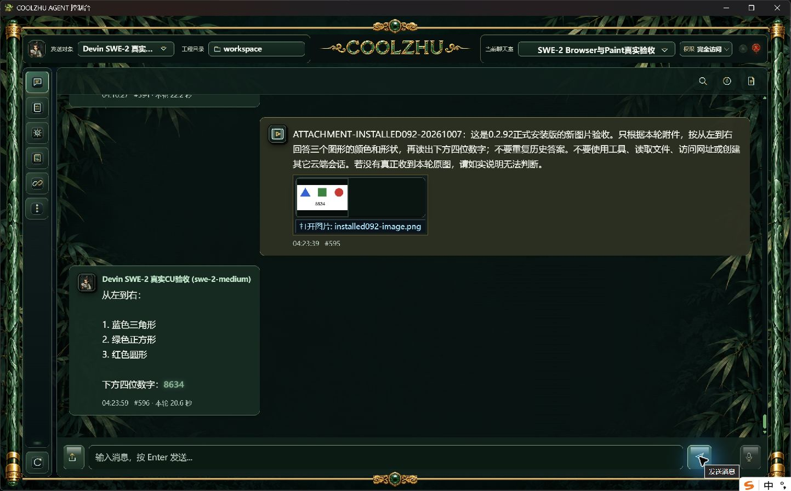
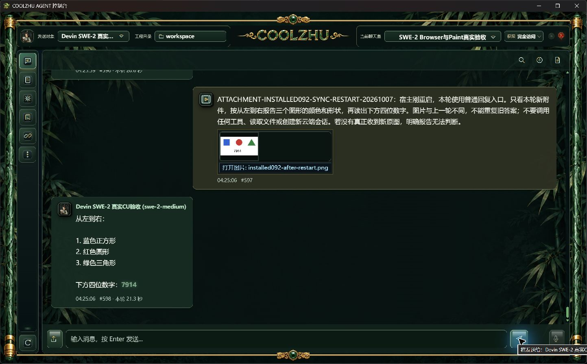

# 0.2.92 Devin 聊天图片附件：改动及正式测试交接

0.2.92 已正常构建、安装及完成两种回复入口的真实图片验收。原 SWE-2-medium 会话和唯一云端 `island-kayak` 保持；重启后使用新图再次识别通过。普通文本聊天此前硬拒绝附件，且普通回复漏传图片，本版补齐图片链路，没有新增云端测试会话。

## 交付身份

| 项目 | 正式值 |
| --- | --- |
| 产品源码 | `7592336143f1068af0ad330fc5b70d1fde2b5162` |
| 源码快照 | `7a2c05aa8426e7de47953e16cd41b513fffbf51ef3472ffcbe65ca49e03a6904` |
| MSI | `CoolzhuAgent-0.2.92.msi`，276392578 字节 |
| MSI SHA256 | `1f7dec9c6eb1e8addc0577f993b0fa3f029a85c76a6f8bd62d6837ec97888951` |
| 实际后台 SHA256 | `2c93d0fee58668f3daaba3d3566e085c7b0f11b4673e3016bf4900fac2586bac` |
| 安装核验 | 正常完整发布六门通过，Windows 安装返回0，1150个安装文件逐一长度/SHA一致 |
| 来源检查 | 冻结产品源码两路 GitHub Web console baseline 均 success |

采用正常发布脚本重新编译最终产品源码，没有跳过发布门或手工替换包内 EXE。安装后的正式后台及原生窗口均从 Program Files 启动，候选后台未用作正式验收。构建身份原始材料见 [build-identity](evidence/build-identity)；安装及恢复事实见 [正式证据清单](installed-attachments/manifest.json)。

## 改动职责与边界

- 聊天接纳仍为单发送对象，只开放图片；普通/流式回复均经过同一多模态预处理及预算检查，禁止静默丢图。准备视觉请求前验证根会话身份、权限和取消状态。
- 独立 `devin_acp/image_input.rs` 将受控 PNG/JPEG/WebP 转为 ACP 原生图片块，供聊天和既有 Computer Use 原图流程共用。图片从文本上下文分离，正文只保留顺序标记；附件元数据参与消息摘要，空附件沿用既有摘要格式。
- `devin_acp/context.rs` 管理上下文增量，`chat.rs` 管理会话接纳及图片提交；不由图片转换模块建立会话或执行工具。现有远端绑定、历史消息、记忆、取消和输入释放机制保留。
- 设置页允许 Devin 用户声明“支持图片直传”，保存时不再重置为空。实际发送还要求 ACP 握手声明图片能力；目录列出模型不等于多模态通过。其它 HTTP 采样/容量参数仍沿用模型默认配置，思考程度使用所选精确模型变体。
- 未支持图片直传时，继续使用既有默认视觉 Agent 转述策略；本轮未另调视觉模型，不能据此追认该降级链重新实测。GIF、任意远程图片 URL、其它文件附件、群发及 Goal/Relay 附件未开放。

具体候选修复、原失败原因及本地验证详见 [候选报告](../2026-10-07-devin-attachments/report.md)。候选和正式材料独立保存，不追认0.2.91包含此修复。前端没有加入调试信息。

## 正式真实模型验收

两轮均使用既有 `session-1791131217833` / `room-1791131523339` / SWE-2-medium。模型提示中未提供图形答案或随机数字，也没有模型回复夹具。

| 入口/场景 | 新图与实际结果 | 耗时 | Run |
| --- | --- | --- | --- |
| 正式原生窗口附件按钮上传并正常发送，流式回复 | 蓝三角、绿方块、红圆及随机数字8634，全部正确 | 20.6秒 | `run-chat-2eb5a9610c87512673cddbb8026089c531705414fb9654c9` |
| 精确停止自有配套并重启，同一数据库与绑定，普通 `/api/chat/send` | 新图蓝方块、红圆、绿三角及随机数字7914，全部正确；刷新原生聊天室显示回复 | 21.3秒 | `run-chat-a27c4d565e4394638af485a07aa99c047986c2c5344a579d` |

每轮均只有一个 attempt，实际模型 `swe-2-medium`、`end_turn`、`process_drained=1`；握手 `prompt_image=true`，实际图片块数量1，未发生工具调用。两轮远端均为 `island-kayak`，内部规划 lane 的远端仍为空。第二轮改变图形顺序和随机数字，避免仅复述历史造成假阳性。

源码本地 actual offline build 通过；Web1400通过/0失败/6忽略，联动8通过、独立1通过，前端16通过。局部协议检查验证图片块顺序、正文无base64和不支持来源拒绝，未替代真实模型截图验收。源码两路远端检查原始记录已纳入清单。

测试结束按完整进程身份停止本轮配套，从正常桌面入口恢复0.2.92、原 `C:\Users\zhupu\coolzhuagent` 工程和原输入安全库。Windows资源仍safe，2个历史 outcome_unknown许可和9个closed记录保留，没有清库。日常界面的Qwen原选择仅恢复显示，本轮未向它发送请求。

## 使用方法及测试设计交接

1. 在设置选择 Devin 会话，模型保留精确变体；将“图片输入能力”设为“支持图片直传”并保存。会话用途保持“对话/代码”，无需改为专用视觉Agent。保留既有登录和模型其它默认参数。
2. 选择该发送对象，通过附件按钮上传PNG/JPEG/WebP后发送。支持图片的ACP连接直接收到原图；不支持的连接必须明确报错，不能只发文字或从历史猜测。
3. 同一个本地Agent与聊天室持续使用原远端绑定。正常重启后继续该聊天室，不另建云端测试会话。

后续针对性用例应检查下列可观察结果，每项通过标准为实际软件截图与相应协议/运行事实共同成立：

| 功能点 | 输入及检查 | 预期/当前覆盖 |
| --- | --- | --- |
| 普通/流式图片直传 | 不同随机图；核实际模型、图片数量、真实回答、聊天室显示 | 两入口本版正式通过 |
| 重启续接 | 同一Agent/room/remote，重启后新图 | 正式通过；不能用旧图答案代替 |
| 不支持图片或预算不足 | 连接能力缺失/图片超预算 | 明确失败、无静默丢图；协议局部检查不等于全部真实环境通过 |
| 其它附件与多目标 | 文本文件/GIF/非受控URL/群发 | 保持明确未接入，不扩大能力承诺 |
| 纯文本视觉转述 | 默认视觉Agent正常可用后发图 | 复用既有策略；本轮未重新实测 |
| 隐私与调试展示 | 图片内容与原图传输分离，前端过程/最终消息检查 | 不向最终UI添加协议调试字段；消息保留用户图片和最终回复 |

本版仅闭环 Devin 普通聊天室图片附件。Goal/Relay附件、账号失效/换模、插件函数执行中取消/超时和许可窄竞争、启动其它模式及四项总体复核仍按 [总验收队列](../../analysis/2026-09-21-integration-review/current-acceptance-queue.md) 推进。复杂浏览器变换/严格按住期间资源变化等既有限制不外推已支持；完整自动升级按原决定延期。Paint依用户要求不再测试，微信不改不测，Opus暂停，无子代理。
