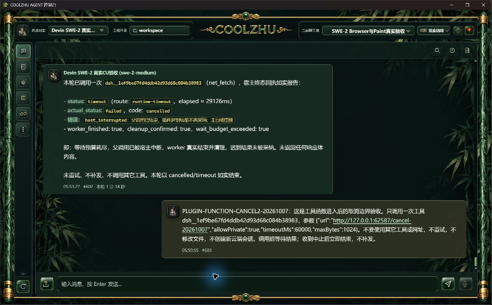

# 0.2.93 改动报告与针对性测试交接

2026-10-07。用户已采纳ImageGen统一玉石控件方向。本版正常完整构建、Windows安装及1154个安装文件逐长度/SHA核验通过；正式原生界面、两个模型连接器目录及真实SWE-2函数执行中取消已通过。四项任务总体仍未完成，免费平台模型生成尚未验收。

## 交付身份

| 项目 | 实际值 |
| --- | --- |
| 产品源码 | `4150fb8c3565e008ce257eb8cecc75f26c89ba3a`，已合入的PR85 |
| 源快照 | `6be03e61a9ab6eb86265c61dc54d9cf7e1866754be082b215cd9f37b74ede81f` |
| MSI | `CoolzhuAgent-0.2.93.msi`，280992798字节 |
| MSI SHA256 | `5a337b520bb1ef10514653fe437cb6c68d2b83009615a09080c4e5428941085f` |
| web-console SHA256 | `f466f86a5465d9e0473e0f8d3c5b4fe76e9b5418f5322d2284aebf0705d30486` |
| shell SHA256 | `026b6dc5bd3e2f98ff1d953f1f0554ed10465a1ac5dd3bff85807166596613cd` |
| 构建/安装 | 正常`build-msi.ps1 -Version 0.2.93 -Configuration release`，六门pass；Windows安装exit 0；1154文件一致 |
| 来源检查 | PR85两条检查成功；冻结merge提交415的Web console baseline一条成功。文档交接PR另核，不混算 |
| 日常恢复 | 正常桌面入口运行Program Files中的093；原工程`C:/Users/zhupu/coolzhuagent`、原输入安全库；自检通过 |

首次构建因此前暂存的DSH运行时仍含旧`source_imports.mjs`被拒。保留该失败，使用正常运行时准备脚本从当前源码重新准备后完整重建通过，未改第三方锁、未手换发布EXE。固定锁SHA为`a64c15bd0ce8c247ddab0c361658ae78be11eb31f4ce5ba3e0602513c27238f7`。

构建原始身份见[evidence/build-identity](evidence/build-identity/)，正式功能清单与逐文件摘要见[manifest](installed-validation/manifest.json)。候选报告保持历史事实，不追认092包含本版修补。

## 变化、职责与影响

| 功能 | 代码位置（相对仓库） | 最终行为与边界 |
| --- | --- | --- |
| 玉石控件 | `modules/gui-web/packages/web-console/src/jade_controls.css`及`assets/ui-redesign/jade-controls-v2/` | 上传、发送、麦克风及顶部玉佩/灯笼使用统一玉石框、细金线图标和居中尺寸；保留title/aria、焦点及状态。Logo、卷轴、竹林沿用原设计；无新增调试栏 |
| 纯图标收尾 | web-console的Devin授权及运行过程跟随组件 | 去除外露按钮文字，保留提示、无障碍名称及状态；不改变授权/取消生命周期 |
| 免费模型入口 | `src/provider_connectors.js`、`src/model_settings.js`、`src/extension_market.js` | 插件市场增加OpenCode/HF模型连接器，复用统一HTTP会话参数及现有工具/SKILL/上下文链路；不创建Devin云端会话，也不将模型入口误称DSH执行插件 |
| 模型发现 | `src/model_discovery.rs` | OpenCode免费聊天白名单与实际目录取交集，不回落付费模型。HF保留`org/model:provider`路由，按提供方读取工具/上下文声明；图片能力只采用明确元数据，未知保持未知 |
| DSH来源兼容 | `modules/tooling`中plugin-system的`dsh_package.rs`及web-console来源接线 | 合法`./index.js`只去除一层`./`；仍拒绝越界路径。收据路径规范化，原package.json字节与来源摘要不改 |
| Node内置模块 | DSH宿主`source_imports.mjs` | Node合法短内置模块名转为`node:`；未登记包和收据外相对导入仍拒绝。此导入检查不等同操作系统沙箱 |

ImageGen提示词、透明资源及候选截图见[控件/连接器专项](../2026-10-07-jade-connectors/report.md)。架构及函数失败沿革见[函数专项](../2026-10-07-plugin-function/report.md)。

## 正式安装版实操

### 控件与目录

1443×897原生软件窗口内，顶部Logo、玉石状态按钮、输入栏图标和底部金框均可见。该截图含旧聊天内容，**只用于控件显示验收，不用其中历史超时文字证明093超时执行**。低高度、高DPI矩阵尚未补验。

插件市场进入两个连接器，实际正常产品目录接口与页面结果一致：OpenCode返回86项目录，免费聊天白名单11项与目录交集为10项；HF返回448个模型及提供方路由。`:novita`路由的图片/工具/容量说明在页面可见，页面明确能力来自目录、尚未实测。目录是动态数据，不能硬编码候选455项为通过条件。

两份草稿均未保存、未输入平台密钥，生成请求为0；发送对象仍为原SWE-2。没有用Qwen或其它平台密钥替代。截图：[OpenCode](installed-validation/native/03-installed-opencode-directory.jpg)、[HF](installed-validation/native/04-installed-hf-directory.jpg)、[路由能力](installed-validation/native/05-installed-hf-route-capabilities.jpg)。原始目录与免费交集包含在manifest中。

### 真实函数执行中取消

原Agent `session-1791131217833`、原聊天室`room-1791131523339`、模型`swe-2-medium`、唯一远端`island-kayak`保持不变。复用固定真实社区插件`izwarm195/dsh-net-tools@7392ec55ca6db884821311d739859ddea72211de`，来源摘要`3b6ee0ea714c22e115d3ce786b876bc1f34b81116d21de79fbd398c0c69c7c8b`。只临时开放net_fetch并访问本机延迟端点，没有代理信息查询或外部网页请求。

本轮`INSTALLED093-FUNCTION-CANCEL-20261007`由原生聊天入口发送。独立观察器见真实GET进入后，调用正常产品中断接口；没有强杀宿主或用模型夹具代替。

| UTC/时刻 | 可核验事件 |
| --- | --- |
| 14:25:46.474771 | 真实网络函数进入本机延迟端点 |
| 14:25:46.505 | 发起正常产品中断 |
| 14:25:46.558 | 中断接口返回 |
| 14:25:46.567 | 外层run持久化为interrupted |
| 14:25:47.588646 | 服务端观察到响应前连接关闭，距GET约1.114秒 |
| 14:25:47.604 | 唯一工具台账收束为failed（取消预期终态） |

只调用一次，无重试、无响应体、无迟到写回；过程栏终态后收起，聊天显示中断提示。[正式截图](installed-validation/native/02-installed-function-cancel.jpg)、[run事实](installed-validation/function/function-run-verification.json)、[单轮工具台账](installed-validation/function/function-tool-ledger.json)、[GET/EOF日志](installed-validation/function/slow-events.jsonl)相互对应。取消不是工具成功返回，不能记成success。

测试后正常关闭本机延迟服务、停用该网络插件、只撤回本次新增工具白名单；原有工具保留。两库无活动run，唯一远端绑定空闲，internal远端为空。正常日常093入口恢复。安全只读摘要为两个resource均safe/accepts_new_input=1；保留历史2项outcome_unknown和9项closed记录，未清库或越过人工复核。

本轮未取得独立Win32进程句柄等待证明，不宣称所有清理阶段均已验证；093正式内层deadline和许可冻结窄竞争仍开放。候选外层等待预算超时有独立证据，不外推为093正式超时通过。

## 连接器使用方法

1. 左侧“更多”→“插件市场”→选择OpenCode或Hugging Face模型连接器，进入新会话配置。
2. 保留该连接器默认官方Base URL：OpenCode `https://opencode.ai/zen/v1`；HF `https://router.huggingface.co/v1`。填写**对应平台自己的凭据**；草稿不会继承现有其它会话密钥。
3. 点击获取模型，选实际返回ID；HF可选具体`:provider`路由。采用有明确声明的图片能力，思考程度由用户选择，其它参数沿用模型默认。
4. 保存后，在顶层发送对象复选框选择新会话。插件目录可读取不等同账号有生成额度；免费额度与模型可用性由平台决定，不自动转付费模型。

## 后续测试设计交接

按真实模型和实操截图判定，优先长程工具任务；以下是后续验收场景，不是新增大量镜像单元测试的要求。

| 场景 | 操作/观察与通过条件 | 本版状态 |
| --- | --- | --- |
| 控件可达性 | 键盘焦点、悬停提示及无障碍名称仍可用；低高度/DPI下图标不裁剪、输入/金框不遮挡 | 正常尺寸实拍通过；尺寸矩阵待补 |
| 连接器目录 | 正常页面读取目录，免费交集无付费回落，HF同模型不同提供方能力独立；草稿取消不改原发送对象/Key | 两平台正式目录通过；全部失败/账户边界未穷举 |
| 连接器长程 | 用户配置对应凭据后，连续文件读写→SKILL/插件工具→Browser操作→纠错，关联单轮/多轮台账与产物 | 待凭据，生成0；不能用目录能力替代 |
| 连接器多模态 | 明确支持图片的路由真实发送原图，纯文本路由走默认视觉转换，检查附件数和结果 | 本版未验 |
| 函数取消 | 先证明函数进入，再正常中断；无重试/迟到写回、run和工具均终态、后续轮次可继续 | 正式进入后取消通过 |
| 函数deadline/冻结 | 分别触发内层deadline、外层预算及许可冻结窄竞争，证明实际执行与清理，不混用宿主启动取消 | 外层预算仅候选；其它待补 |
| Browser复杂变换 | 旋转/斜切/透视、父裁剪、多层owner命中；严格按下期间跨URL/关闭/面板替换无错投递 | 原普通/Shadow/iframe/OOP/LTR/RTL/当前页证据保留；本版未新增 |
| 启动特殊模式 | 资源加载失败、减弱动作、首次/重启边界；完整舞剑不能以兜底画面替代 | 演出/Esc/重复启动已有证据，其它开放 |

源码功能回归沿用PR85最终结果：控制台1400通过/0失败/6忽略，前端16通过，插件45通过/0失败/1忽略；模型发现最后5项检查及离线构建通过。本轮从同一合入源码正常完整发布构建，不把构建成功替代功能验收，也未改产品代码后省略重编。

总体待办仍包括共享异步轮次循环、跨进程单写者/outbox/epoch、Devin Goal/Relay及附件/账号/换模边界、FTS规模、SKILL记忆压缩和LSP/PTY生命周期，详见[32工作包矩阵](../../analysis/2026-09-21-integration-review/wbs-implementation-audit-2026-10-07.md)与[当前队列](../../analysis/2026-09-21-integration-review/current-acceptance-queue.md)。Paint按用户决定不再测试，微信不动，Opus暂停；完整自动下载安装重启按原决定延期。

## 公开分发核验

[0.2.93预发布](https://github.com/coolzhulike/coolzhuagent/releases/tag/v0.2.93)已公开；MSI、installer-report、package-safety及MSI SHA文件四个资产的服务端长度/SHA全部匹配，实际tag为冻结产品4150fb8。桌面dist中的四份分发文件也逐长度/SHA匹配。详见[服务端核验](evidence/github-release-verification.json)。[PR86](https://github.com/coolzhulike/coolzhuagent/pull/86)归档正式证据，未自动合入；文档PR远端检查按最终HEAD另核，不能用冻结源码检查替代。
